# Календарь начало.

[https://www.youtube.com/watch?reload=9&v=D6VPU846L1c&t=532s](https://www.youtube.com/watch?reload=9&v=D6VPU846L1c&t=532s)

Первым делом устанавливаю библиотеку moment.js [https://momentjs.com/](https://momentjs.com/) (7:03).

В календаре нужно понять как его нарисовать. Данная библиотека является оберткой над стандартным Data. Данная библиотека очень -очень прокаченая.

Наша задача понять как получить дни для вывода календаря. Сейчас я буду работать с месяцем.

И так посмотрим что из себя представляет данная библиотека.

```jsx
import React from 'react';
import ReactDOM from 'react-dom';

import moment from 'moment';

console.log(moment());

const App = () => {
  return (
    <div>
      <p>Проверка перезагрузки</p>
    </div>
  );
};

ReactDOM.render(<App />, document.getElementById('root'));
```

И вот мы получаем здоровенный объект.

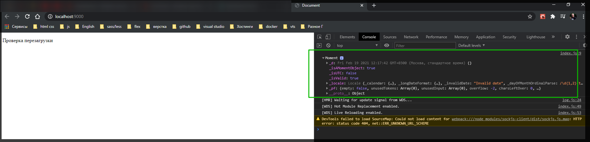

Для того что бы было удобно работать с этой библиотекой я в глобальную переменную window.moment = moment; запихиваю саму библиотеку.

```js
import React from 'react';
import ReactDOM from 'react-dom';

import moment from 'moment';

console.log(moment());

window.moment = moment;

const App = () => {
  return (
    <div>
      <p>Проверка перезагрузки</p>
    </div>
  );
};

ReactDOM.render(<App />, document.getElementById('root'));
```

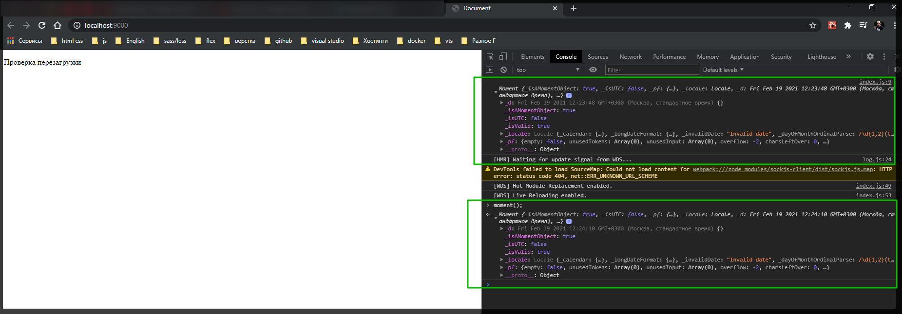

И так что нам нужно для нашего календаря? И так в devTools обращаюсь к moment() и обращаюсь к методу startOf('month'). И вот смотрю на начало месяца. Т.е. точка отсчета.

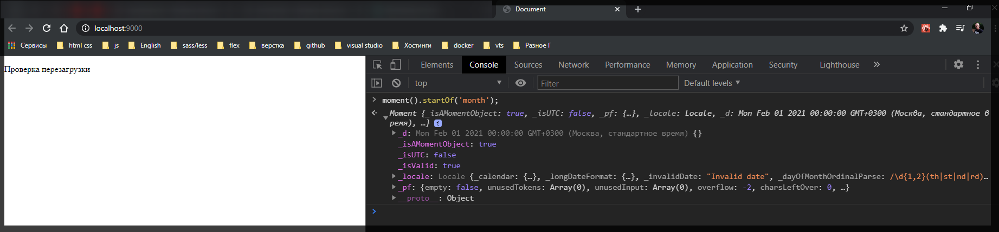

И теперь я хочу знать конец месяца moment().endOf('month');

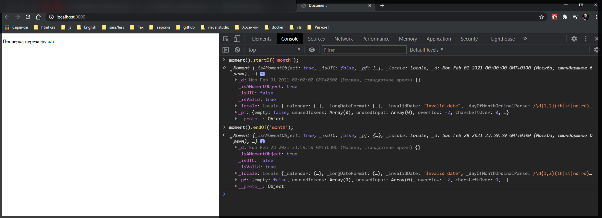

Но нам же нужно чуть сильнее сместиться. Т.е. мне нужно знать начало недели и конец недели. И теперь вот таким вот замечательным способом я могу узнать начало недели **moment().startOf('month').startOf('week')**

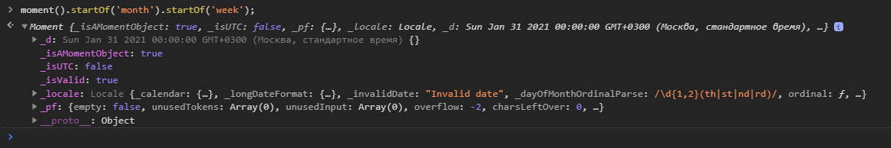

И если обратить внимание то здесь неделя начинается с воскресенья. Это так и есть в США.
И в программировании этот день нулевой. И потом 1, 2, 3 индексы массива.

И соответственно последний день неделиmoment().endOf('month').endOf('week');.

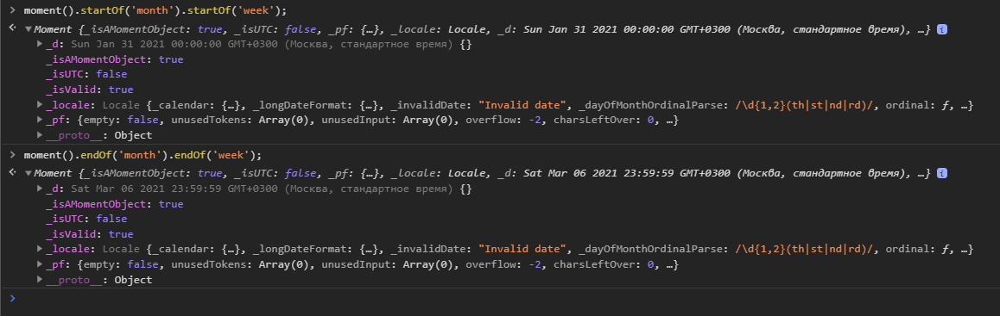

Но мы то живем в европе. И для того что бы неделя начиналась с понедельника я могу использовать moment.updateLocale(). В ее параметры передаю какую локаль мы юзаем. Он ставит **en** английскую. Я попробую ru. Вторым параметром идет объект конфигурации в котором указываю что я хочу откорректировать неделю т.е. что бы она начиналась с понедельника. И в ключе указываю объект в котором прописываю down:1 т.е. вот так это будет выглядеть moment().updateLocale('ru',{week:{down:1}}); Указываю индекс с какого дня должно все начатся.

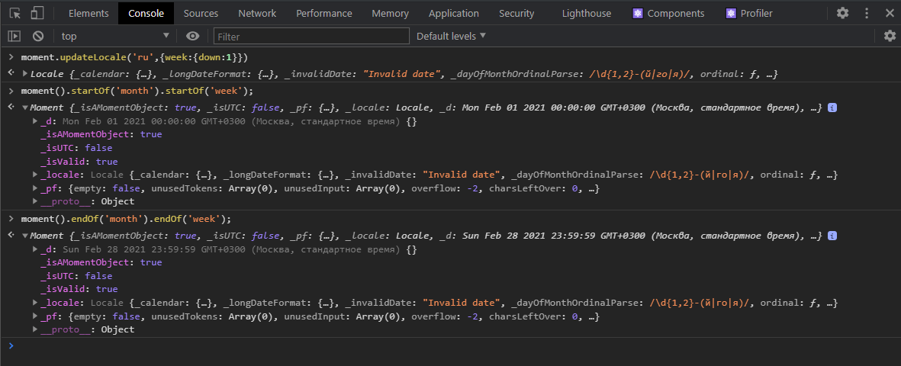

И теперь начало и конец недели сделаны так как надо. Для удобста перенесу все в react.

```jsx
import React from 'react';
import ReactDOM from 'react-dom';

import moment from 'moment';

console.log(moment());

window.moment = moment; // запихиваю библиотеку в глабольный объект

moment.updateLocale('ru', { week: { down: 1 } });
const startDay = moment().startOf('month').startOf('week');
const endDay = moment().endOf('month').endOf('week');

console.log(startDay.format('YYYY-MM-DD'));
console.log(endDay.format('YYYY-MM-DD'));

const App = () => {
  return (
    <div>
      <p>Проверка перезагрузки</p>
    </div>
  );
};

ReactDOM.render(<App />, document.getElementById('root'));
```

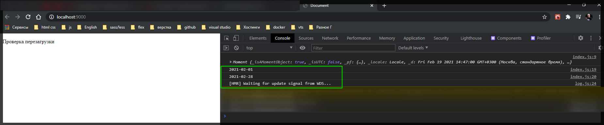

Странно не применяется .startOf('week'); при локале ru. Если выставляю rus то показывает правильно начало и конец недели.

```jsx
import React from 'react';
import ReactDOM from 'react-dom';

import moment from 'moment';

console.log(moment());

window.moment = moment; // запихиваю библиотеку в глабольный объект

moment.updateLocale('rus', { week: { down: 1 } });
const startDay = moment().startOf('month').startOf('week');
const endDay = moment().endOf('month').endOf('week');

console.log(startDay.format('YYYY-MM-DD'));
console.log(endDay.format('YYYY-MM-DD'));

const App = () => {
  return (
    <div>
      <p>Проверка перезагрузки</p>
    </div>
  );
};

ReactDOM.render(<App />, document.getElementById('root'));
```

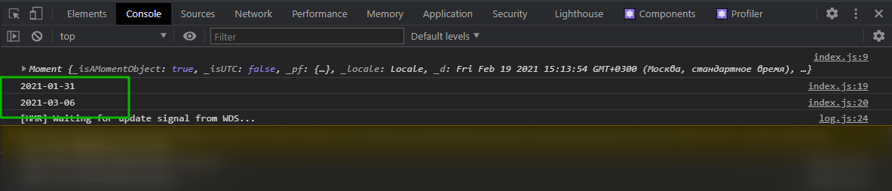

Теперь нужно получить промежуток всех этих дат от начала и до конца. И вот тут включается математика. Кароче, нужно получить массив данных.

Создаю пустой массив const calendar = []; Сначало он у нас пустой. Мы его будем заполнять. Мы можем манипулировать счетчиком.

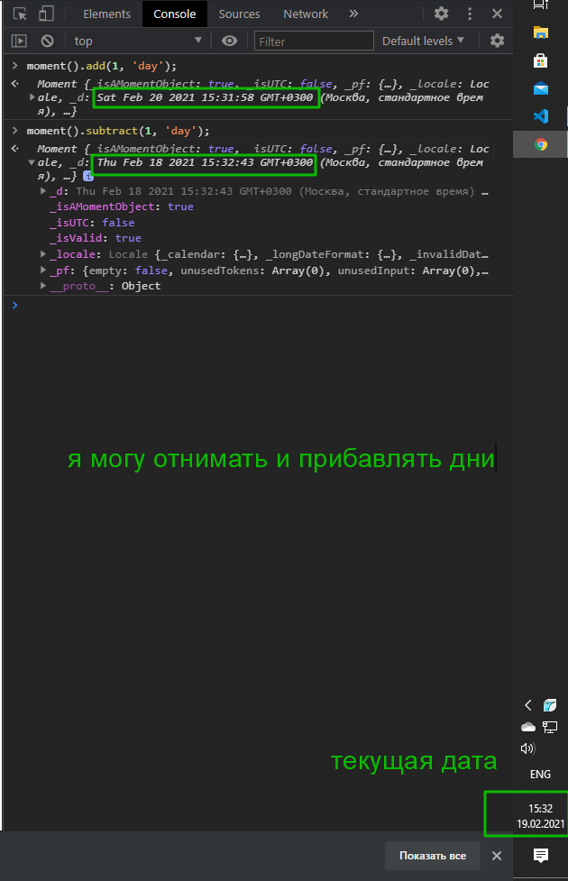

Исходя из этого я могу управлять счетчиком. т.е. я могу от startDay прибавлять по одному дню, на каждой итерации полученное значение буду заносить в массив. Заношу до тех пор пока не дойдем до конечной точки которой является endDay.

Для этого использую цикл while. создаю переменную в которую помещаю стартовый день const day = startDay;. После чего в теле условия обращаюсь к пустому массиву и добавляю в него значение переменной в которой находится стартовый день calendar.push(day);

Выглядит это как-то так.

```jsx
import React from 'react';
import ReactDOM from 'react-dom';

import moment from 'moment';

console.log(moment());

window.moment = moment; // запихиваю библиотеку в глабольный объект

moment.updateLocale('rus', { week: { down: 1 } });
const startDay = moment().startOf('month').startOf('week');
const endDay = moment().endOf('month').endOf('week');

console.log(startDay.format('YYYY-MM-DD'));
console.log(endDay.format('YYYY-MM-DD'));

const calendar = [];
const day = startDay;

while (day) {
  calendar.push(day);
}

const App = () => {
  return (
    <div>
      <p>Проверка перезагрузки</p>
    </div>
  );
};

ReactDOM.render(<App />, document.getElementById('root'));
```

Теперь мне нужно сместиться на один день вперед. Для этого обращаюсь к day.add(1,'day'). В условии указываю последний день для этого обращаюсь к методу isSame библиотеки moment.js где в параметрах указываю последний день я именно

Это все еще черновик

```js
const calendar = [];
const day = startDay;

while (day.isSame(endDay)) {
  calendar.push(day);
  day.add(1, 'day');
}
```

Лучше использовать цикл do while... Проверки идет в конце и по этому хотябы одна итерация отработает. Сейчс цикл не запуститься т.к. у него изначально в условии false т.е. в него ничего не прилетает. А если даже и прелитит то значение startDay изменится и будет новая отправная точка. Так называемая мутация массива.

Для того что бы такое не происходило необходимо скопировать массив

```jsx
import React from 'react';
import ReactDOM from 'react-dom';

import moment from 'moment';

console.log(moment());

window.moment = moment; // запихиваю библиотеку в глабольный объект

moment.updateLocale('rus', { week: { down: 1 } });
const startDay = moment().startOf('month').startOf('week');
const endDay = moment().endOf('month').endOf('week');

// console.log(startDay.format('YYYY-MM-DD'));
// console.log(endDay.format('YYYY-MM-DD'));

window.startDay = startDay; //Это добавляю для удобства в консоли позже уберу
window.endDay = endDay; //

const calendar = [];
const day = startDay.clone();

window.day = day;

while (day.isSame(endDay)) {
  calendar.push(day);
  day.add(1, 'day');
}

const App = () => {
  return (
    <div>
      <p>Проверка перезагрузки</p>
    </div>
  );
};

ReactDOM.render(<App />, document.getElementById('root'));
```

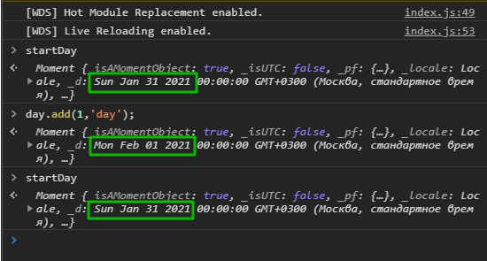

И так теперь стартовая дата остается стартовой.

И так все еще пытаюсь допедрить по механике.

И так пробую вот такое условие. while(!day.isAfter()). Эта функция из библиотеки moment.js [https://momentjs.com/docs/#/query/is-after/](https://momentjs.com/docs/#/query/is-after/)

```jsx
import React from 'react';
import ReactDOM from 'react-dom';

import moment from 'moment';

// console.log(moment());

window.moment = moment; // запихиваю библиотеку в глабольный объект

moment.updateLocale('rus', { week: { down: 1 } });
const startDay = moment().startOf('month').startOf('week');
const endDay = moment().endOf('month').endOf('week');

// console.log(startDay.format('YYYY-MM-DD'));
// console.log(endDay.format('YYYY-MM-DD'));

window.startDay = startDay; //Это добавляю для удобства в консоли позже уберу
window.endDay = endDay; //

const calendar = [];
const day = startDay.clone();

window.day = day;

while (!day.isAfter(endDay)) {
  console.log(day);
  calendar.push(day);
  day.add(1, 'day');
}

const App = () => {
  return (
    <div>
      <p>Проверка перезагрузки</p>
    </div>
  );
};

ReactDOM.render(<App />, document.getElementById('root'));
```

И проверяю данное условие в devTools баузера !day.isAfter(endDay). Грубо говоря заполнение идет до тех пор пока полученное значение на каждой итерации не равно endDay. Пока переменная не равна условие истинно. Как только они становятся равными условие становится false и происходит остановка и выход из цикла.

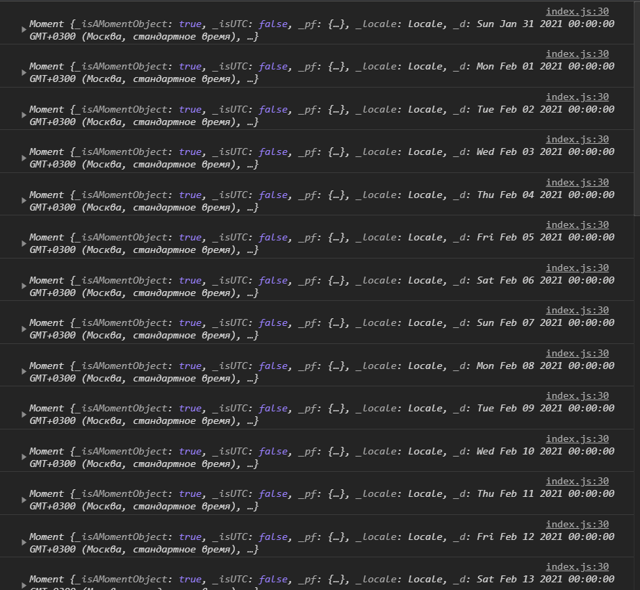

У меня вроде как все правильно. На каждой итерации новый день. Однако у него происходит мутация и каждый раз выводится значение дня полученное на первой итеации.

Хотя если вывести занесенные данные в массив у меня получается все тоже самое.

```js
import React from 'react';
import ReactDOM from 'react-dom';

import moment from 'moment';

// console.log(moment());

window.moment = moment; // запихиваю библиотеку в глабольный объект

moment.updateLocale('rus', { week: { down: 1 } });
const startDay = moment().startOf('month').startOf('week');
const endDay = moment().endOf('month').endOf('week');

// console.log(startDay.format('YYYY-MM-DD'));
// console.log(endDay.format('YYYY-MM-DD'));

window.startDay = startDay; //Это добавляю для удобства в консоли позже уберу
window.endDay = endDay; //

const calendar = [];
const day = startDay.clone();

window.day = day;

while (!day.isAfter(endDay)) {
  // console.log(day);
  calendar.push(day);
  day.add(1, 'day');
}
console.log(calendar);

const App = () => {
  return (
    <div>
      <p>Проверка перезагрузки</p>
    </div>
  );
};

ReactDOM.render(<App />, document.getElementById('root'));
```

Постоянно выводится 7 марта.

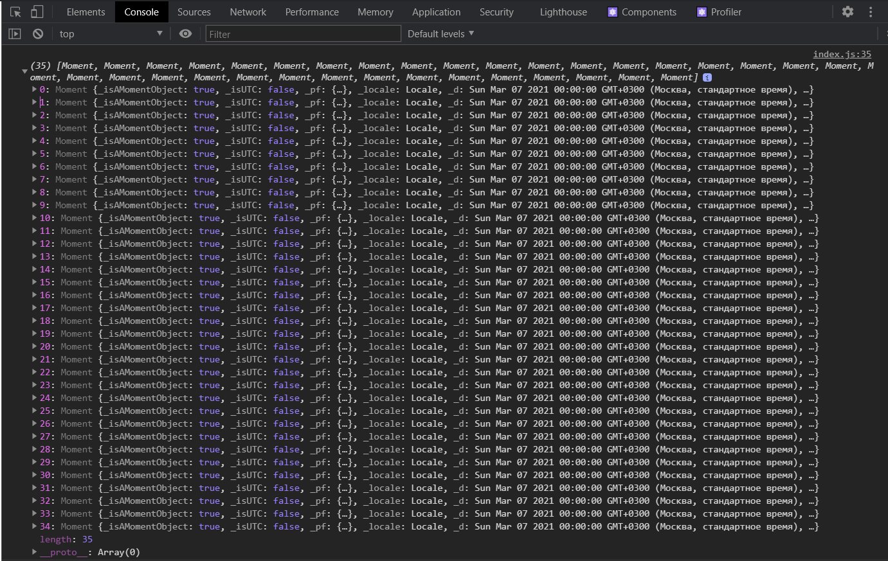

Для того что бы все сработало необходимо склонировать полученное значение дня на каждой итерации и только после этого одно должно занестись в массив. т.е.

```js
import React from 'react';
import ReactDOM from 'react-dom';

import moment from 'moment';

// console.log(moment());

window.moment = moment; // запихиваю библиотеку в глабольный объект

moment.updateLocale('rus', { week: { down: 1 } });
const startDay = moment().startOf('month').startOf('week');
const endDay = moment().endOf('month').endOf('week');

// console.log(startDay.format('YYYY-MM-DD'));
// console.log(endDay.format('YYYY-MM-DD'));

window.startDay = startDay; //Это добавляю для удобства в консоли позже уберу
window.endDay = endDay; //

const calendar = [];
const day = startDay.clone();

window.day = day;

while (!day.isAfter(endDay)) {
  // console.log(day);
  calendar.push(day.clone());
  day.add(1, 'day');
}
console.log(calendar);

const App = () => {
  return (
    <div>
      <p>Проверка перезагрузки</p>
    </div>
  );
};

ReactDOM.render(<App />, document.getElementById('root'));
```

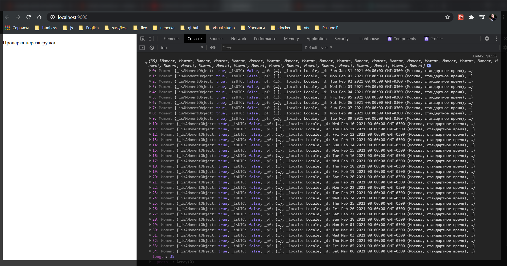

И все супер!! У нас полностью набрался стек дней календаря. Я получаю массив объектов. Далее разберу верстку.
