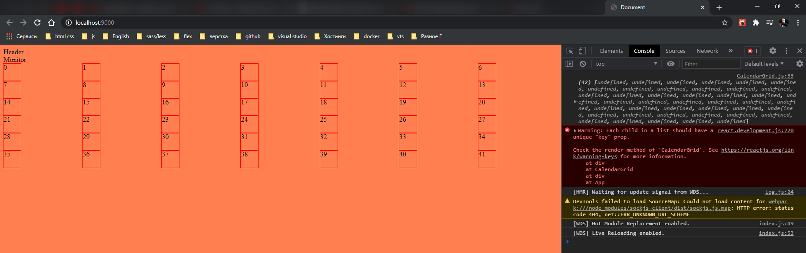
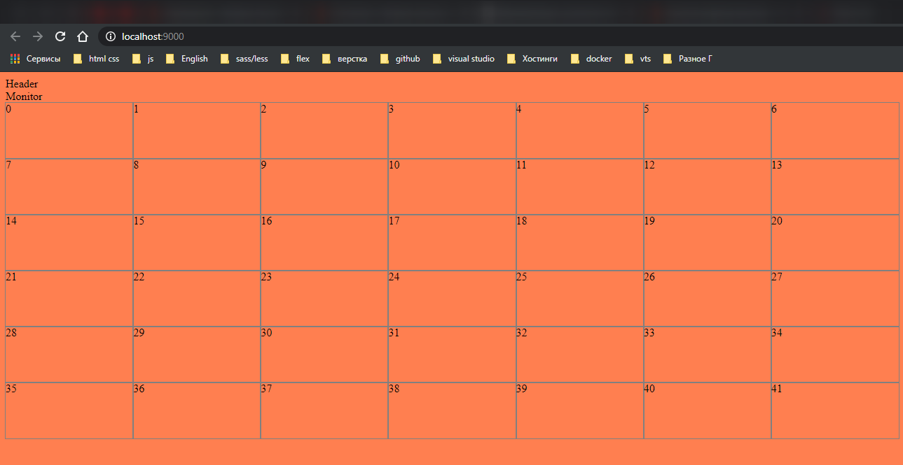
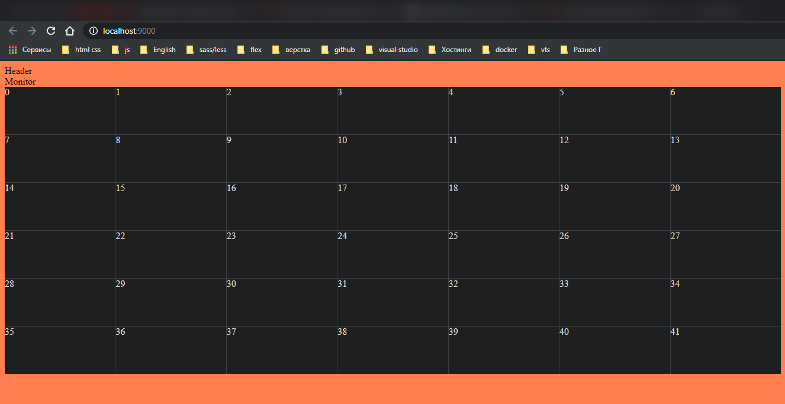
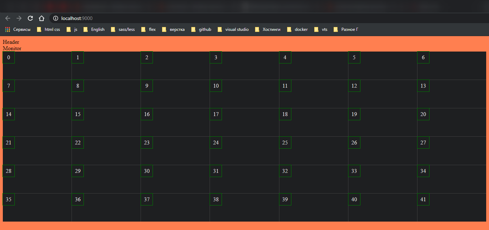
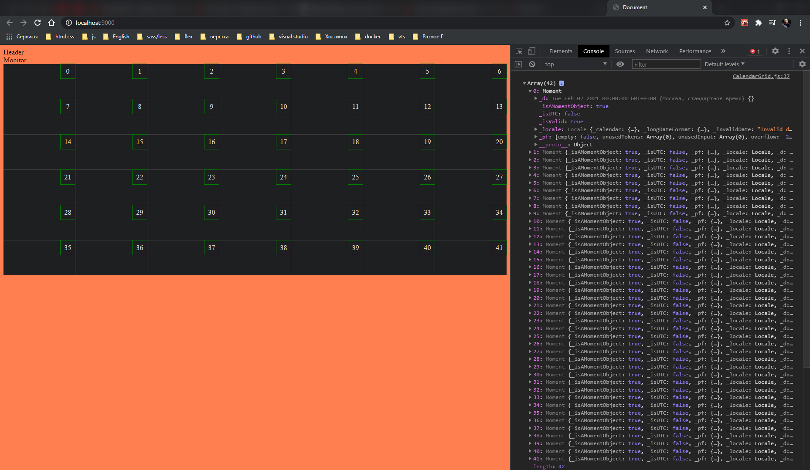
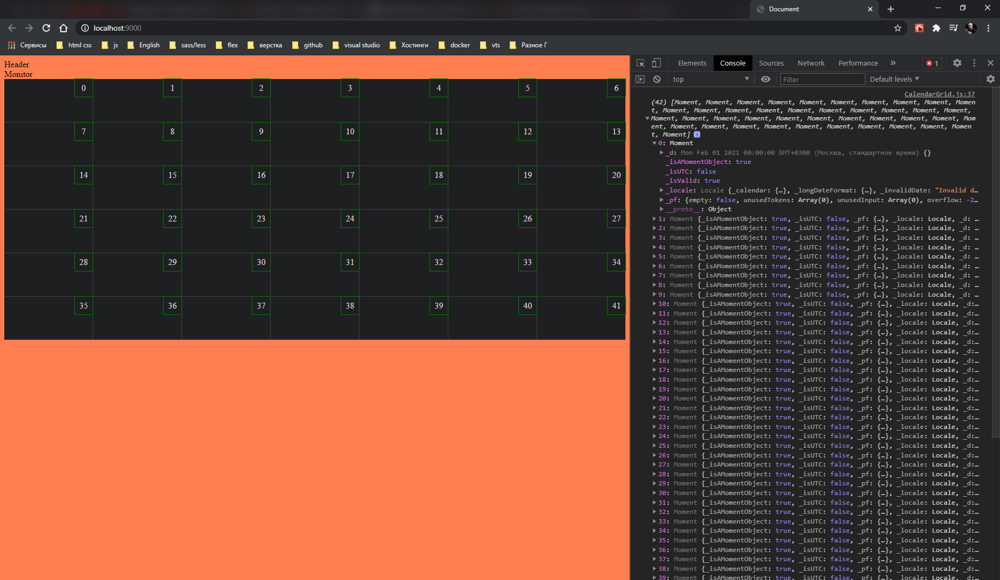
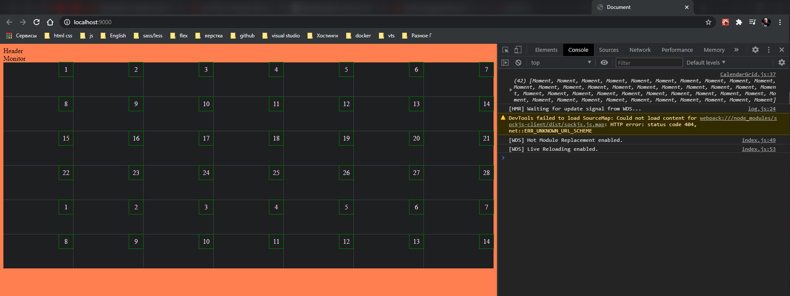
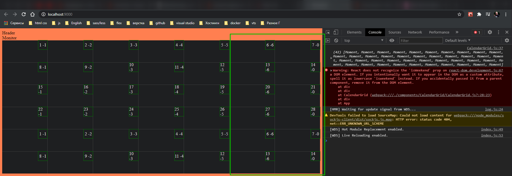
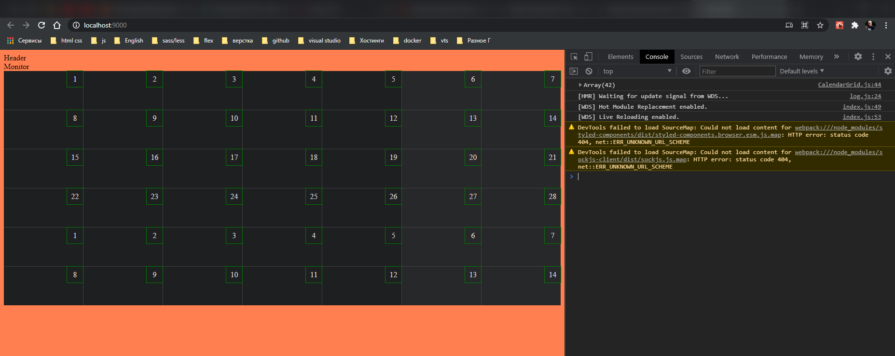

# Декомпозиция

[https://developer.mozilla.org/ru/docs/Web/CSS/CSS_Grid_Layout/Basic_Concepts_of_Grid_Layout](https://developer.mozilla.org/ru/docs/Web/CSS/CSS_Grid_Layout/Basic_Concepts_of_Grid_Layout)

[https://medium.com/@stasonmars/%D0%B2%D0%B5%CC%88%D1%80%D1%81%D1%82%D0%BA%D0%B0-%D0%BD%D0%B0-grid-%D0%B2-css-%D0%BF%D0%BE%D0%BB%D0%BD%D0%BE%D0%B5-%D1%80%D1%83%D0%BA%D0%BE%D0%B2%D0%BE%D0%B4%D1%81%D1%82%D0%B2%D0%BE-%D0%B8-%D1%81%D0%BF%D1%80%D0%B0%D0%B2%D0%BE%D1%87%D0%BD%D0%B8%D0%BA-220508316f8b](https://medium.com/@stasonmars/%D0%B2%D0%B5%CC%88%D1%80%D1%81%D1%82%D0%BA%D0%B0-%D0%BD%D0%B0-grid-%D0%B2-css-%D0%BF%D0%BE%D0%BB%D0%BD%D0%BE%D0%B5-%D1%80%D1%83%D0%BA%D0%BE%D0%B2%D0%BE%D0%B4%D1%81%D1%82%D0%B2%D0%BE-%D0%B8-%D1%81%D0%BF%D1%80%D0%B0%D0%B2%D0%BE%D1%87%D0%BD%D0%B8%D0%BA-220508316f8b)

1. **Header**, **title** или что-то в этом роде. Имеет в себе переключатель День, Неделя, Месяц, год. Поиск.
2. Придумай название компонента. Имеет в зависимости от того что выбрано в **header** переключатель между месяц, год и т.д. С левой стороны отображение выбранного месяца и года.
3. Сетка календаря

Создаю компоненты **CalendarGrid**, **Header**, **Monitor**, **App**.

Разбивка на компоненты.

<br>
<br>
<hr>

Компонент **CalendarGrid**

```jsx
import React from 'react';
import './CalendarGrid.scss';

const CalendarGrid = () => {
  return <div>CalendarGrid</div>;
};

export default CalendarGrid;
```

```jsx
import CalendarGrid from './CalendarGrid';

export default CalendarGrid;
```

<br>
<br>
<hr>

Компонент **Header**

```jsx
import React from 'react';
import './Header.scss';

const Header = () => {
  return <div>Header</div>;
};

export default Header;
```

```jsx
import Header from './Header';

export default Header;
```

<br>
<br>
<hr>

Компонент **Monitor**

```jsx
import React from 'react';
import './Monitor.scss';

const Monitor = () => {
  return <div>Monitor</div>;
};

export default Monitor;
```

```jsx
import Monitor from './Monitor';

export default Monitor;
```

<br>
<br>
<hr>

Компонент **App**

```js
import React from 'react';

import moment from 'moment';

import Header from '../Header';
import Monitor from '../Monitor';
import CalendarGrid from '../CalendarGrid';

import './App.scss';

// console.log(moment());

window.moment = moment; // запихиваю библиотеку в глабольный объект

moment.updateLocale('ru', { week: { down: 1 } });
const startDay = moment().startOf('month').startOf('week');
const endDay = moment().endOf('month').endOf('week');

const calendar = [];
const day = startDay.clone();

while (!day.isAfter(endDay)) {
  calendar.push(day.clone());
  day.add(1, 'day');
}
console.log(calendar);
window.startDay = startDay; //Это добавляю для удобства в консоли позже уберу
window.endDay = endDay; //
window.day = day;

const App = () => {
  return (
    <div>
      <Header />
      <Monitor />
      <CalendarGrid />
    </div>
  );
};

export default App;
```

<br>
<br>
<hr>

**entry.point index.js**

```jsx
import App from './app';

export default App;
```

```jsx
import React from 'react';
import ReactDOM from 'react-dom';

import App from './components/app/index';

ReactDOM.render(<App />, document.getElementById('root'));
```

<br>
<br>
<hr>

**Постановка задачи**.

Так же декомпозирую. Первая задача создать механику.

1. Календарь состоит из 6-ти недель. Это максимальное количество недель в месяце. Больше не бывает. Их бывает от четырех до шести. Если выводить по предыдущей механике с помощью **moment.js**, то размеры календаря будут плавать. Это херово!!! По - этому делаю 6-ть недель для того что бы он не плавал. **6 \* 7 = 42** ячейки.
2. Получить структуру данных состоящую из **42** ячеек.

Начинаю работу в компоненте **CalendarGrid**.

Создаю константу в которой будет содержаться количество ячеек.

```js
import React from 'react';
import './CalendarGrid.scss';

const CalendarGrid = () => {
  const totalDays = 42;

  return <div>CalendarGrid</div>;
};

export default CalendarGrid;
```

Далее создаю структуру которая будет собственно хранить эти дни. **const daysArray = []; Это массив, важно!!!** Которая будет содержать 42 ячейки. И сначало я делаю пустышку **const daysArray = [...Array(42)];**

И вывожу.

```js
import React from 'react';
import './CalendarGrid.scss';

const CalendarGrid = () => {
  const totalDays = 42;
  const daysArray = [...Array(42)];

  return (
    <div>
      {daysArray.map(() => {
        <div></div>;
      })}
    </div>
  );
};

export default CalendarGrid;
```

А вот внутри **div** я могу вывести 42 ничего. Но я лучше выведу индексы массива.
И так для вывода значений мне пришлось слега по другому написать.

```jsx
//components/CalendarGrid/CalendarGrid.js
import React from 'react';
import './CalendarGrid.scss';

const CalendarGrid = () => {
  const totalDays = 42;
  const daysArray = [...Array(42)];
  // window.daysArray = daysArray;
  console.log(daysArray);

  return (
    <div>
      {daysArray.map((_, i) => {
        return <div className="indexItem">{i}</div>;
      })}
    </div>
  );
};

export default CalendarGrid;
```

3. Создание сетки календаря.

```scss
//components/CalendarGrid/CalendarGrid.scss
.Wrapper_columns {
  display: grid;
  grid-template-columns: 1fr 1fr 1fr 1fr 1fr 1fr 1fr; // разбиваю на калонки
}

.indexItem {
  width: 40px;
  height: 40px;
  outline: 1px solid red;
}
```



Но так никто не пишет. Указываю **repead** сколько раз повторить **7** и размер **1rf**.

```scss
//components/CalendarGrid/CalendarGrid.scss
.Wrapper_columns {
  display: grid;
  grid-template-columns: repeat(7, 1fr); // разбиваю на калонки
}

.indexItem {
  width: 40px;
  height: 40px;
  outline: 1px solid red;
}
```

И так же задаю **tamplate** для строк.

```jsx
//components/CalendarGrid/CalendarGrid.js
import React from 'react';
import './CalendarGrid.scss';

const CalendarGrid = () => {
  const totalDays = 42;
  const daysArray = [...Array(42)];
  // window.daysArray = daysArray;
  console.log(daysArray);

  return (
    <div className="GridWrapper">
      {daysArray.map((_, i) => {
        return <div className="indexItem">{i}</div>;
      })}
    </div>
  );
};

export default CalendarGrid;
```

```scss
//components/CalendarGrid/CalendarGrid.scss
.GridWrapper {
  display: grid;
  grid-template-columns: repeat(7, 1fr); // разбиваю на колонки
  grid-template-rows: repeat(6, 1fr);
}

.indexItem {
  width: 40px;
  height: 40px;
  outline: 1px solid red;
}
```

<br>
<br>
<br>

4. Верстка сетки.

```scss
//components/CalendarGrid/CalendarGrid.scss
.GridWrapper {
  display: grid;
  grid-template-columns: repeat(7, 1fr); // разбиваю на колонки
  grid-template-rows: repeat(6, 1fr);
}
.CellWrapper {
  min-width: 140px;
  min-height: 80px;
  outline: 1px solid gray;
}
// .indexItem {
//   width: 40px;
//   height: 40px;
// }
```



```scss
//components/CalendarGrid/CalendarGrid.scss
.GridWrapper {
  display: grid;
  grid-template-columns: repeat(7, 1fr); // разбиваю на колонки
  grid-template-rows: repeat(6, 1fr);
  grid-gap: 1px; // зазор между ячейками
  background-color: #404040; // цвет подложки
}
.CellWrapper {
  min-width: 140px;
  min-height: 80px;
  background-color: #1e1f21;
  color: #dddcdd;
}
// .indexItem {
//   width: 40px;
//   height: 40px;
// }
```



Теперь отодвигаю индексы в правый верхний угол и делаю отступы.

И так в самой ячейке будут строки **RowInCell**. Но Для даты нужно сделать отдельную обертку.

```jsx
//components/CalendarGrid/CalendarGrid.js
import React from 'react';
import './CalendarGrid.scss';

const CalendarGrid = () => {
  const totalDays = 42;
  const daysArray = [...Array(42)];
  // window.daysArray = daysArray;
  console.log(daysArray);

  return (
    <div className="GridWrapper">
      {daysArray.map((_, i) => {
        return (
          <div className="CellWrapper">
            <div className="indexItem">
              <div className="RowInCell">
                <div className="DayWrapper">{i}</div>
              </div>
            </div>
          </div>
        );
      })}
    </div>
  );
};

export default CalendarGrid;
```

Задаю размер блока самого числа и позиционирую

```scss
//components/CalendarGrid/CalendarGrid.scss
.GridWrapper {
  display: grid;
  grid-template-columns: repeat(7, 1fr); // разбиваю на колонки
  grid-template-rows: repeat(6, 1fr);
  grid-gap: 1px; // зазор между ячейками
  background-color: #404040; // цвет подложки
}
.CellWrapper {
  min-width: 140px;
  min-height: 80px;
  background-color: #1e1f21;
  color: #dddcdd;
}
.DayWrapper {
  height: 33px;
  width: 33px;
  display: flex;
  align-items: center;
  justify-content: center;
  outline: 1px solid green;
}
```



Далее будет контролируемое смещение вправо. В **RowInCell** я буду говорить как будет происходить выравнивание. Кароче он тут функцию использует. Т.к. у меня данной библиотеки нет я просто пишу силь.

```scss
//components/CalendarGrid/CalendarGrid.scss
.GridWrapper {
  display: grid;
  grid-template-columns: repeat(7, 1fr); // разбиваю на колонки
  grid-template-rows: repeat(6, 1fr);
  grid-gap: 1px; // зазор между ячейками
  background-color: #404040; // цвет подложки
}
.CellWrapper {
  min-width: 140px;
  min-height: 80px;
  background-color: #1e1f21;
  color: #dddcdd;
}

.RowInCell {
  display: flex;
  justify-content: flex-end;
}
.DayWrapper {
  height: 33px;
  width: 33px;
  display: flex;
  align-items: center;
  justify-content: center;
  outline: 1px solid green;
}
```

<br>
<br>
<br>

5. Вывод даты.

Сами ячейки необходимо заполнить инстансами даты.

И так мне нужен стартовый день откуда мы начинаем считать. Для этого в компоненте **App.js** в качестве props передаю стартовый день в компонент **\<CalendarGrid startDay={startDay} />**.

```jsx
//components/app/App.js
import React from 'react';

import moment from 'moment';

import Header from '../Header';
import Monitor from '../Monitor';
import CalendarGrid from '../CalendarGrid';

import './App.scss';

// console.log(moment());

// window.moment = moment; // запихиваю библиотеку в глабольный объект

moment.updateLocale('ru', { week: { down: 1 } });
const startDay = moment().startOf('month').startOf('week');
const endDay = moment().endOf('month').endOf('week');

// const calendar = [];
// const day = startDay.clone();

// while (!day.isAfter(endDay)) {
//   calendar.push(day.clone());
//   day.add(1, 'day');
// }
// console.log(calendar);
// window.startDay = startDay; //Это добавляю для удобства в консоли позже уберу
// window.endDay = endDay; //
// window.day = day;

const App = () => {
  return (
    <div>
      <Header />
      <Monitor />
      <CalendarGrid startDay={startDay} />
    </div>
  );
};

export default App;
```

И теперь в компоненте **CalendarGrid** я его должен перехватить **const CalendarGrid = ({startDay}) =>**. Далее мне нужна переменная const **day = startDay.clone();** Далее мне нужно заполнить массив **const** **daysArray = [...Array(42)].map(() => day.add(1, 'day').clone());** И не забываю выставить ключи в **\<div className="CellWrapper" key={\_}>** пока указываю что он равен какой-то херне.. И выведу в консоль результат. кароче передача ключей у меня выдало ошибку. Позже их передам.

```jsx
//components/app/App.js
import React from 'react';

import moment from 'moment';

import Header from '../Header';
import Monitor from '../Monitor';
import CalendarGrid from '../CalendarGrid';

import './App.scss';

// console.log(moment());

// window.moment = moment; // запихиваю библиотеку в глабольный объект

moment.updateLocale('ru', { week: { down: 1 } });
const startDay = moment().startOf('month').startOf('week');
const endDay = moment().endOf('month').endOf('week');

// const calendar = [];
// const day = startDay.clone();

// while (!day.isAfter(endDay)) {
//   calendar.push(day.clone());
//   day.add(1, 'day');
// }
// console.log(calendar);
// window.startDay = startDay; //Это добавляю для удобства в консоли позже уберу
// window.endDay = endDay; //
// window.day = day;

const App = () => {
  return (
    <div>
      <Header />
      <Monitor />
      <CalendarGrid startDay={startDay} />
    </div>
  );
};

export default App;
```

```jsx
//components/CalendarGrid/CalendarGrid.js
import React from 'react';
import './CalendarGrid.scss';

const CalendarGrid = ({ startDay }) => {
  const totalDays = 42;
  const day = startDay.clone();
  const daysArray = [...Array(42)].map(() => day.add(1, 'day').clone());
  // window.daysArray = daysArray;
  console.log(daysArray);

  return (
    <div className="GridWrapper">
      {daysArray.map((_, i) => {
        return (
          <div className="CellWrapper">
            <div className="indexItem">
              <div className="RowInCell">
                <div className="DayWrapper">{i}</div>
              </div>
            </div>
          </div>
        );
      })}
    </div>
  );
};

export default CalendarGrid;
```



И так у меня все сместилось на один день.
Для этого в переменной day, указываю, после клонирования массива, **subtract(1, 'day');**

```jsx
//components/CalendarGrid/CalendarGrid.js
import React from 'react';
import './CalendarGrid.scss';

const CalendarGrid = ({ startDay }) => {
  const totalDays = 42;
  const day = startDay.clone().subtract(1, 'day');
  const daysArray = [...Array(42)].map(() => day.add(1, 'day').clone());
  // window.daysArray = daysArray;
  console.log(daysArray);

  return (
    <div className="GridWrapper">
      {daysArray.map((_, i) => {
        return (
          <div className="CellWrapper">
            <div className="indexItem">
              <div className="RowInCell">
                <div className="DayWrapper">{i}</div>
              </div>
            </div>
          </div>
        );
      })}
    </div>
  );
};

export default CalendarGrid;
```



И теперь все тип-топ.

И теперь вместо индексов вывожу сами даты. Придумывает свойство **dayItem** и передаю его в **daysArray.map((dayItem) =>**. при передаче ключа указываю в какой формате выводить **\<div className="CellWrapper" key={dayItem.format('DDMMYY')}>**. И далее при выводе дня указываю в каком формате выводить день **\<div className="DayWrapper">{dayItem.format('D')}</div>**.

```jsx
//components/CalendarGrid/CalendarGrid.js
import React from 'react';
import './CalendarGrid.scss';

const CalendarGrid = ({ startDay }) => {
  const totalDays = 42;
  const day = startDay.clone().subtract(1, 'day');
  const daysArray = [...Array(42)].map(() => day.add(1, 'day').clone());
  // window.daysArray = daysArray;
  console.log(daysArray);

  return (
    <div className="GridWrapper">
      {daysArray.map((dayItem) => {
        return (
          <div className="CellWrapper" key={dayItem.format('DDMMYY')}>
            <div className="indexItem">
              <div className="RowInCell">
                <div className="DayWrapper">{dayItem.format('D')}</div>
              </div>
            </div>
          </div>
        );
      })}
    </div>
  );
};

export default CalendarGrid;
```

```jsx
//components/app/App.js
import React from 'react';

import moment from 'moment';

import Header from '../Header';
import Monitor from '../Monitor';
import CalendarGrid from '../CalendarGrid';

import './App.scss';

// console.log(moment());

// window.moment = moment; // запихиваю библиотеку в глабольный объект

moment.updateLocale('ru', { week: { down: 1 } });
const startDay = moment().startOf('month').startOf('week');
const endDay = moment().endOf('month').endOf('week');

// const calendar = [];
// const day = startDay.clone();

// while (!day.isAfter(endDay)) {
//   calendar.push(day.clone());
//   day.add(1, 'day');
// }
// console.log(calendar);
// window.startDay = startDay; //Это добавляю для удобства в консоли позже уберу
// window.endDay = endDay; //
// window.day = day;

const App = () => {
  return (
    <div>
      <Header />
      <Monitor />
      <CalendarGrid startDay={startDay} />
    </div>
  );
};

export default App;
```



и вот вывод всех дат.

6. Отображание выходных дней.

Для этого на **div** с классом **CellWrapper** нужно повешать событие при котором будет меняться цвет. Для начало пропишу просто **isWeekend={true}**.

```jsx
//components/CalendarGrid/CalendarGrid.js
import React from 'react';
import './CalendarGrid.scss';

const CalendarGrid = ({ startDay }) => {
  const totalDays = 42;
  const day = startDay.clone().subtract(1, 'day');
  const daysArray = [...Array(42)].map(() => day.add(1, 'day').clone());
  // window.daysArray = daysArray;
  console.log(daysArray);

  return (
    <div className="GridWrapper">
      {daysArray.map((dayItem) => {
        return (
          <div
            className="CellWrapper"
            key={dayItem.format('DDMMYY')}
            isWeekend={true}
          >
            <div className="indexItem">
              <div className="RowInCell">
                <div className="DayWrapper">{dayItem.format('D')}</div>
              </div>
            </div>
          </div>
        );
      })}
    </div>
  );
};

export default CalendarGrid;
```

Для того что бы узнать под какими индексами находяться дни есть специальный метод **dayItem.day()** т.е. **{dayItem.format('D')} -{dayItem.day()}**.

```jsx
//components/CalendarGrid/CalendarGrid.js
import React from 'react';
import './CalendarGrid.scss';

const CalendarGrid = ({ startDay }) => {
  const totalDays = 42;
  const day = startDay.clone().subtract(1, 'day');
  const daysArray = [...Array(42)].map(() => day.add(1, 'day').clone());
  // window.daysArray = daysArray;
  console.log(daysArray);

  return (
    <div className="GridWrapper">
      {daysArray.map((dayItem) => {
        return (
          <div
            className="CellWrapper"
            key={dayItem.format('DDMMYY')}
            isWeekday={true}
          >
            <div className="indexItem">
              <div className="RowInCell">
                <div className="DayWrapper">
                  {dayItem.format('D')} -{dayItem.day()}
                </div>
              </div>
            </div>
          </div>
        );
      })}
    </div>
  );
};

export default CalendarGrid;
```

И вот я вижу под какими номерами у меня выходные дни.



Теперь это вырезаю **-{dayItem.day()}**. А в isWeekend пишу следующее **isWeekday={dayItem.day === 6 || dayItem.day === 0}**.

```jsx
import React from 'react';

import './CalendarGrid.scss';

const CalendarGrid = ({ startDay }) => {
  const day = startDay.clone().subtract(1, 'day');
  const daysArray = [...Array(42)].map(() => day.add(1, 'day').clone());
  // window.daysArray = daysArray;
  console.log(daysArray);

  return (
    <div className="GridWrapper">
      {daysArray.map((dayItem) => {
        return (
          <div
            className="CellWrapper"
            key={dayItem.format('DDMMYY')}
            isWeekday={dayItem.day === 6 || dayItem.day === 0}
          >
            <div className="indexItem">
              <div className="RowInCell">
                <div className="DayWrapper">{dayItem.format('D')}</div>
              </div>
            </div>
          </div>
        );
      })}
    </div>
  );
};

export default CalendarGrid;
```

Теперь нужно придумать как повешать цвет.

```shell
npm install styled-components
```

Сильно я не хотел использовать инлайновые стили. Но ничего не поделаешь!!!

У становка и использование библиотеки [https://styled-components.com/docs/basics#installation](https://styled-components.com/docs/basics#installation).

```json
// .babelrc
{
  "presets": [
    [
      "@babel/preset-env",
      {
        "corejs": 3.8, // Указываю версию библиотеки
        "useBuiltIns": "usage", // это означает то что babel попытается найти те места в коде которые используют новые функции языка и подключить только нужные polyfills
        "debug": true, // вывод потдерживаемых браузеров
        "modules": false, // запрет трансформации import
        "targets": {
          "chrome": "58",
          "ie": "11"
        }
      }
    ],
    "@babel/preset-react"
  ],
  "plugins": [
    ["@babel/plugin-proposal-class-properties"],
    "babel-plugin-styled-components"
  ]
}
```

```jsx
//components/CalendarGrid/CalendarGrid.js
import React from 'react';
import styled from 'styled-components';
import './CalendarGrid.scss';

const CellWrapper = styled.div`
  background-color: ${(props) => (props.isWeekday ? '#27282A' : '#1E1F21')};
`;

const CalendarGrid = ({ startDay }) => {
  const day = startDay.clone().subtract(1, 'day');
  const daysArray = [...Array(42)].map(() => day.add(1, 'day').clone());
  // window.daysArray = daysArray;
  console.log(daysArray);

  return (
    <div className="GridWrapper">
      {daysArray.map((dayItem) => {
        return (
          <CellWrapper
            className="CellWrapper"
            key={dayItem.format('DDMMYY')}
            isWeekday={dayItem.day() === 6 || dayItem.day() === 0}
          >
            <div className="indexItem">
              <div className="RowInCell">
                <div className="DayWrapper">{dayItem.format('D')}</div>
              </div>
            </div>
          </CellWrapper>
        );
      })}
    </div>
  );
};

export default CalendarGrid;
```


