# Вывод дней недели. Выделяем активный месяц.

Вывод дней буду делать в компоненте **CalendarGrid.js** в **div** c классом **GridWrapper**. Делаю пустышку. Вывожу семь ячеек. **{[...Array(7)].map(() => \<CellWrapper/>)}**.

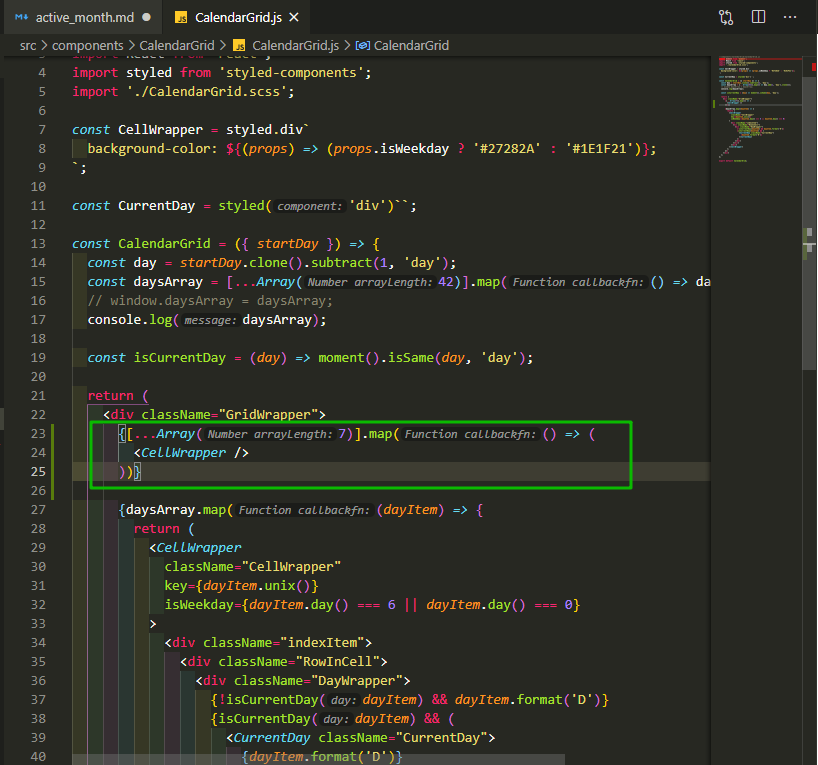

```jsx
//components/CalendarGrid/CalendarGrid.js
import moment from 'moment';
import React from 'react';
import styled from 'styled-components';
import './CalendarGrid.scss';

const CellWrapper = styled.div`
  background-color: ${(props) => (props.isWeekday ? '#27282A' : '#1E1F21')};
`;

const CurrentDay = styled('div')``;

const CalendarGrid = ({ startDay }) => {
  const day = startDay.clone().subtract(1, 'day');
  const daysArray = [...Array(42)].map(() => day.add(1, 'day').clone());
  // window.daysArray = daysArray;
  console.log(daysArray);

  const isCurrentDay = (day) => moment().isSame(day, 'day');

  return (
    <div className="GridWrapper">
      {[...Array(7)].map(() => (
        <CellWrapper />
      ))}

      {daysArray.map((dayItem) => {
        return (
          <CellWrapper
            className="CellWrapper"
            key={dayItem.unix()}
            isWeekday={dayItem.day() === 6 || dayItem.day() === 0}
          >
            <div className="indexItem">
              <div className="RowInCell">
                <div className="DayWrapper">
                  {!isCurrentDay(dayItem) && dayItem.format('D')}
                  {isCurrentDay(dayItem) && (
                    <CurrentDay className="CurrentDay">
                      {dayItem.format('D')}
                    </CurrentDay>
                  )}
                </div>
              </div>
            </div>
          </CellWrapper>
        );
      })}
    </div>
  );
};

export default CalendarGrid;
```

И вот я вывожу семь ничего.

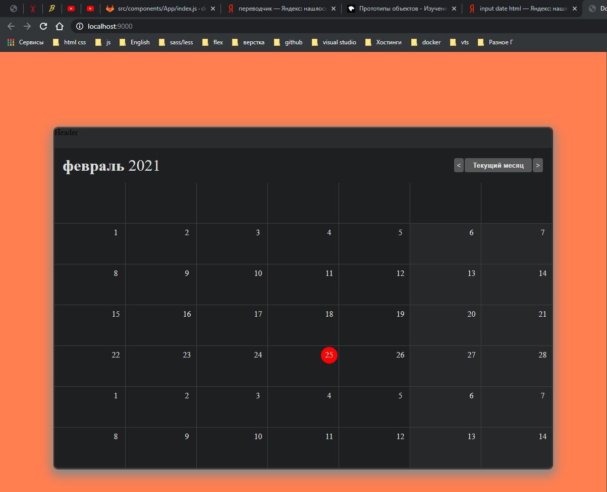

Делаю ячейки по меньше. Для изменения размера при выводе **CellWrapper** вешаю на него **props** **isHeader**.... Надо хорошенько проштудировать документацию. И называею его

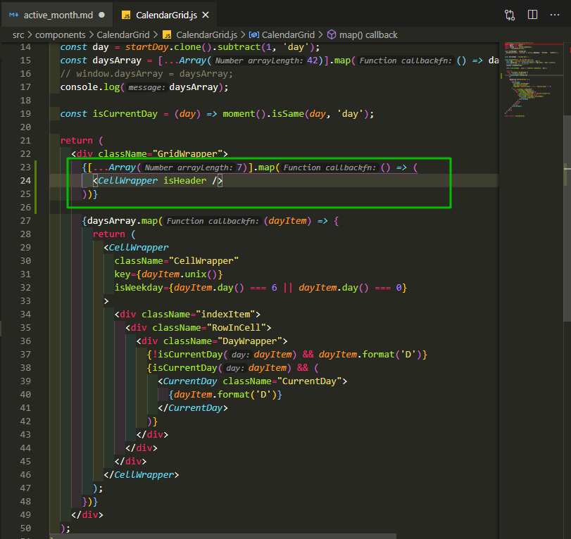

```jsx
//components/CalendarGrid/CalendarGrid.js
import moment from 'moment';
import React from 'react';
import styled from 'styled-components';
import './CalendarGrid.scss';

const CellWrapper = styled.div`
  background-color: ${(props) => (props.isWeekday ? '#27282A' : '#1E1F21')};
`;

const CurrentDay = styled('div')``;

const CalendarGrid = ({ startDay }) => {
  const day = startDay.clone().subtract(1, 'day');
  const daysArray = [...Array(42)].map(() => day.add(1, 'day').clone());
  // window.daysArray = daysArray;
  console.log(daysArray);

  const isCurrentDay = (day) => moment().isSame(day, 'day');

  return (
    <div className="GridWrapper">
      {[...Array(7)].map(() => (
        <CellWrapper isHeader />
      ))}

      {daysArray.map((dayItem) => {
        return (
          <CellWrapper
            className="CellWrapper"
            key={dayItem.unix()}
            isWeekday={dayItem.day() === 6 || dayItem.day() === 0}
          >
            <div className="indexItem">
              <div className="RowInCell">
                <div className="DayWrapper">
                  {!isCurrentDay(dayItem) && dayItem.format('D')}
                  {isCurrentDay(dayItem) && (
                    <CurrentDay className="CurrentDay">
                      {dayItem.format('D')}
                    </CurrentDay>
                  )}
                </div>
              </div>
            </div>
          </CellWrapper>
        );
      })}
    </div>
  );
};

export default CalendarGrid;
```

И далее в

```jsx
const CellWrapper = styled.div`
  background-color: ${(props) => (props.isWeekday ? '#27282A' : '#1E1F21')};
`;
```

Прописываю условие для высоты. В **scss** в атрибуте .**CellWrapper** вырезаю **min-height: 80px;**

```jsx
const CellWrapper = styled.div`
  background-color: ${(props) => (props.isWeekday ? '#27282A' : '#1E1F21')};
  min-height: ${(props) => (props.isHeader ? 24 : 80)}px;
`;
```

И для того что бы стили применились в **scss** в **.GridWrapper** удаляю **grid-template-rows: repeat(6, 1fr);** и того весь код.

```jsx
//components/CalendarGrid/CalendarGrid.js
import moment from 'moment';
import React from 'react';
import styled from 'styled-components';
import './CalendarGrid.scss';

const CellWrapper = styled.div`
  background-color: ${(props) => (props.isWeekday ? '#27282A' : '#1E1F21')};
  min-height: ${(props) => (props.isHeader ? 24 : 80)}px;
`;

const CurrentDay = styled('div')``;

const CalendarGrid = ({ startDay }) => {
  const day = startDay.clone().subtract(1, 'day');
  const daysArray = [...Array(42)].map(() => day.add(1, 'day').clone());
  // window.daysArray = daysArray;
  console.log(daysArray);

  const isCurrentDay = (day) => moment().isSame(day, 'day');

  return (
    <div className="GridWrapper">
      {[...Array(7)].map(() => (
        <CellWrapper isHeader />
      ))}

      {daysArray.map((dayItem) => {
        return (
          <CellWrapper
            className="CellWrapper"
            key={dayItem.unix()}
            isWeekday={dayItem.day() === 6 || dayItem.day() === 0}
          >
            <div className="indexItem">
              <div className="RowInCell">
                <div className="DayWrapper">
                  {!isCurrentDay(dayItem) && dayItem.format('D')}
                  {isCurrentDay(dayItem) && (
                    <CurrentDay className="CurrentDay">
                      {dayItem.format('D')}
                    </CurrentDay>
                  )}
                </div>
              </div>
            </div>
          </CellWrapper>
        );
      })}
    </div>
  );
};

export default CalendarGrid;
```

```scss
//components/CalendarGrid/CalendarGrid.scss
.GridWrapper {
  display: grid;
  grid-template-columns: repeat(7, 1fr); // разбиваю на колонки
  // grid-template-rows: repeat(6, 1fr);
  grid-gap: 1px; // зазор между ячейками
  background-color: #404040; // цвет подложки
}
.CellWrapper {
  // min-height: 80px;
  min-width: 140px;
  background-color: #1e1f21;
  color: #dddcdd;
}

.RowInCell {
  display: flex;
  justify-content: flex-end;
}
.DayWrapper {
  height: 33px;
  width: 33px;
  display: flex;
  align-items: center;
  justify-content: center;
  margin: 2px;
  // outline: 1px solid green;
}

.CurrentDay {
  height: 100%;
  width: 100%;
  background-color: #f00;
  border-radius: 50%;
  display: flex;
  justify-content: center;
  align-items: center;
}
```

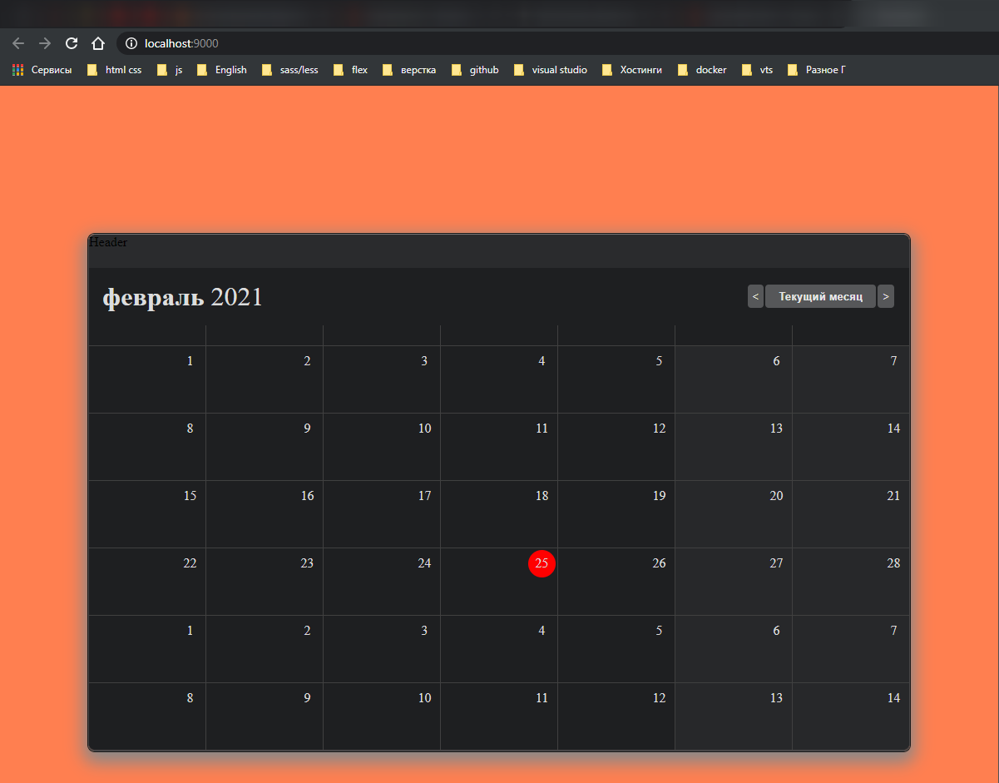

И так теперь нужно убрать лишние **border**. Но **border** у нас зделаны очень хитро. Они с деланы с помощью **grid-gap: 1px;**

И так смотри внимательнее.... для того что бы вывести два одинаковых рутовых элемента на одной иерархии так сказать

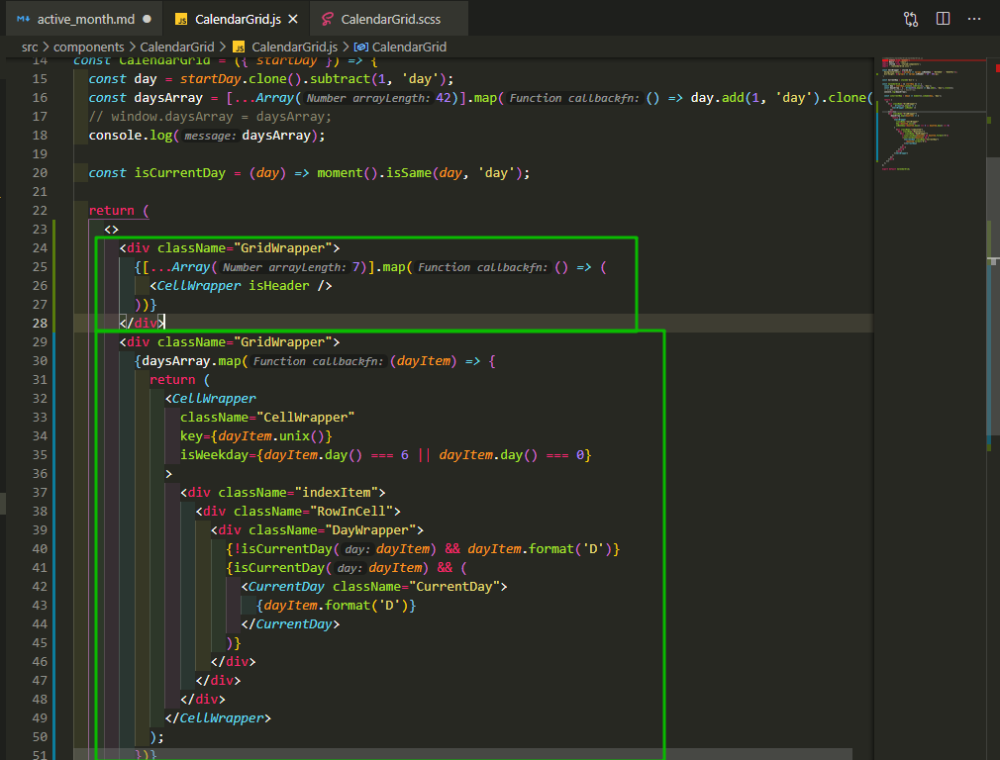

Для этого необходимо обернуть все элементы во **fragment** т.е. **\<>\</>** [https://reactjs.org/docs/fragments.html](https://reactjs.org/docs/fragments.html) Это функциональный компонент который рендерит **props** **children**. Он не добавляет разметку. Он отрендеривает лишь то что в нутрь его передали. Теперь пропали нижняя полоска.

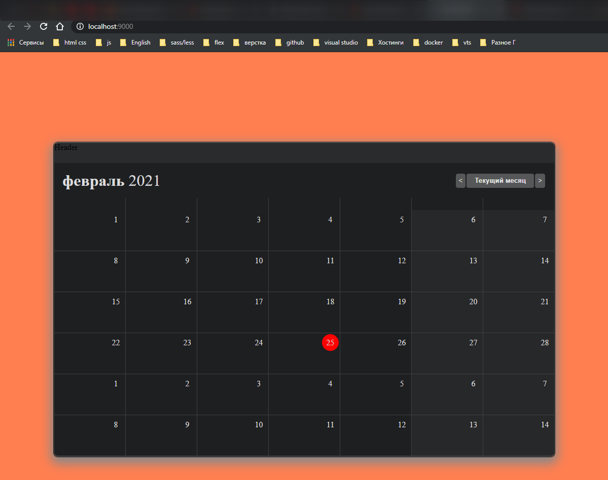

Создаю стайловый компонент **GridWrapper**. Переименовыываю все **div** c классом **GridWrapper**. И говорю что компонент вывода дней тоже должен быть **isHeader**. И в стилях **GridWrapper** прописываю условие.

```jsx
//components/CalendarGrid/CalendarGrid.js
import moment from 'moment';
import React from 'react';
import styled from 'styled-components';
import './CalendarGrid.scss';

const GridWrapper = styled.div`
  background-color: ${(props) => (props.isHeader ? '#1e1f21' : '#4d4c4d')};
`;

const CellWrapper = styled.div`
  background-color: ${(props) => (props.isWeekday ? '#27282A' : '#1E1F21')};
  min-height: ${(props) => (props.isHeader ? 24 : 80)}px;
`;

const CurrentDay = styled('div')``;

const CalendarGrid = ({ startDay }) => {
  const day = startDay.clone().subtract(1, 'day');
  const daysArray = [...Array(42)].map(() => day.add(1, 'day').clone());
  // window.daysArray = daysArray;
  console.log(daysArray);

  const isCurrentDay = (day) => moment().isSame(day, 'day');

  return (
    <>
      <GridWrapper className="GridWrapper" isHeader>
        {[...Array(7)].map(() => (
          <CellWrapper isHeader />
        ))}
      </GridWrapper>
      <GridWrapper className="GridWrapper">
        {daysArray.map((dayItem) => {
          return (
            <CellWrapper
              className="CellWrapper"
              key={dayItem.unix()}
              isWeekday={dayItem.day() === 6 || dayItem.day() === 0}
            >
              <div className="indexItem">
                <div className="RowInCell">
                  <div className="DayWrapper">
                    {!isCurrentDay(dayItem) && dayItem.format('D')}
                    {isCurrentDay(dayItem) && (
                      <CurrentDay className="CurrentDay">
                        {dayItem.format('D')}
                      </CurrentDay>
                    )}
                  </div>
                </div>
              </div>
            </CellWrapper>
          );
        })}
      </GridWrapper>
    </>
  );
};

export default CalendarGrid;
```

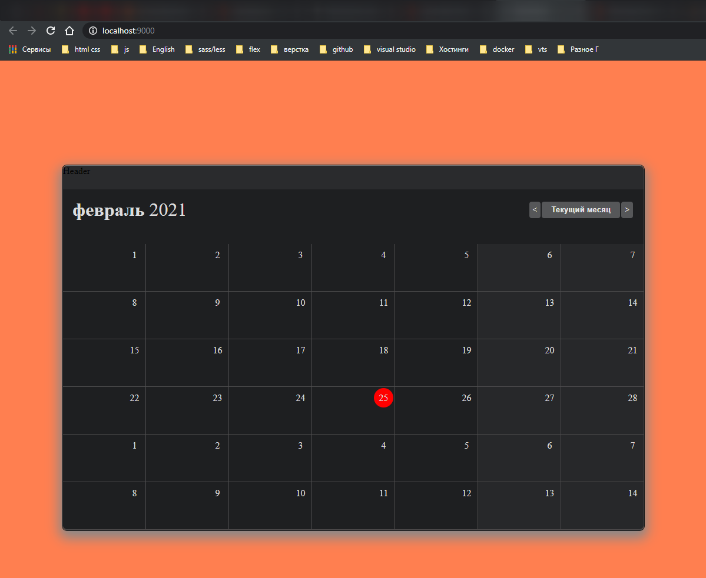

И теперь под выводом дней необходимо вывести нижний **border**. Для этого опять пишу условие **${(props) => props.isHeader && 'border-bottom: 1px solid #4d4c4d'}**

```jsx
//components/CalendarGrid/CalendarGrid.js
import moment from 'moment';
import React from 'react';
import styled from 'styled-components';
import './CalendarGrid.scss';

const GridWrapper = styled.div`
  background-color: ${(props) => (props.isHeader ? '#1e1f21' : '#4d4c4d')};
  ${(props) => props.isHeader && 'border-bottom: 1px solid #4d4c4d'}
`;

const CellWrapper = styled.div`
  background-color: ${(props) => (props.isWeekday ? '#27282A' : '#1E1F21')};
  min-height: ${(props) => (props.isHeader ? 24 : 80)}px;
`;

const CurrentDay = styled('div')``;

const CalendarGrid = ({ startDay }) => {
  const day = startDay.clone().subtract(1, 'day');
  const daysArray = [...Array(42)].map(() => day.add(1, 'day').clone());
  // window.daysArray = daysArray;
  console.log(daysArray);

  const isCurrentDay = (day) => moment().isSame(day, 'day');

  return (
    <>
      <GridWrapper className="GridWrapper" isHeader>
        {[...Array(7)].map(() => (
          <CellWrapper isHeader />
        ))}
      </GridWrapper>
      <GridWrapper className="GridWrapper">
        {daysArray.map((dayItem) => {
          return (
            <CellWrapper
              className="CellWrapper"
              key={dayItem.unix()}
              isWeekday={dayItem.day() === 6 || dayItem.day() === 0}
            >
              <div className="indexItem">
                <div className="RowInCell">
                  <div className="DayWrapper">
                    {!isCurrentDay(dayItem) && dayItem.format('D')}
                    {isCurrentDay(dayItem) && (
                      <CurrentDay className="CurrentDay">
                        {dayItem.format('D')}
                      </CurrentDay>
                    )}
                  </div>
                </div>
              </div>
            </CellWrapper>
          );
        })}
      </GridWrapper>
    </>
  );
};

export default CalendarGrid;
```


Теперь в массиве осталось вывести наши дни. Сначало вывожу индексы.

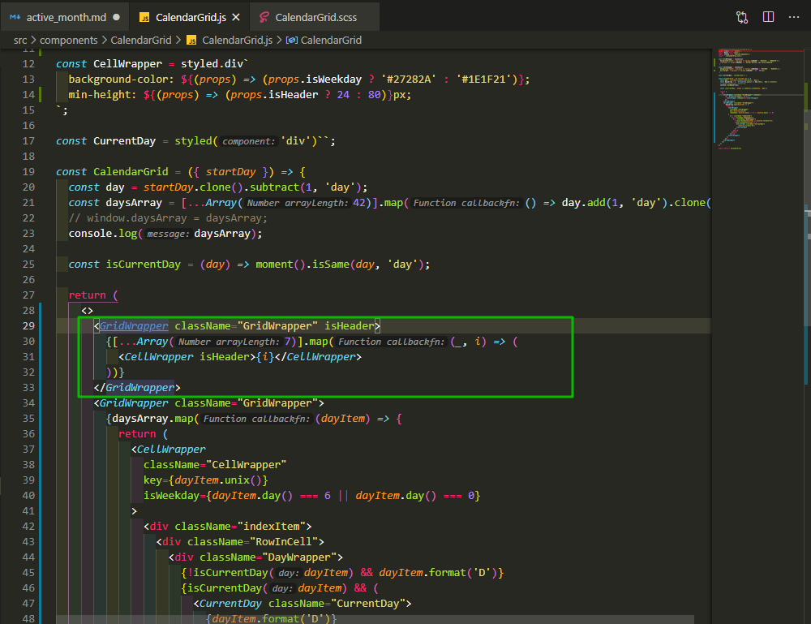

```jsx
//components/CalendarGrid/CalendarGrid.js
import moment from 'moment';
import React from 'react';
import styled from 'styled-components';
import './CalendarGrid.scss';

const GridWrapper = styled.div`
  background-color: ${(props) => (props.isHeader ? '#1e1f21' : '#4d4c4d')};
  ${(props) => props.isHeader && 'border-bottom: 1px solid #4d4c4d'}
`;

const CellWrapper = styled.div`
  background-color: ${(props) => (props.isWeekday ? '#27282A' : '#1E1F21')};
  min-height: ${(props) => (props.isHeader ? 24 : 80)}px;
`;

const CurrentDay = styled('div')``;

const CalendarGrid = ({ startDay }) => {
  const day = startDay.clone().subtract(1, 'day');
  const daysArray = [...Array(42)].map(() => day.add(1, 'day').clone());
  // window.daysArray = daysArray;
  console.log(daysArray);

  const isCurrentDay = (day) => moment().isSame(day, 'day');

  return (
    <>
      <GridWrapper className="GridWrapper" isHeader>
        {[...Array(7)].map((_, i) => (
          <CellWrapper isHeader>{i}</CellWrapper>
        ))}
      </GridWrapper>
      <GridWrapper className="GridWrapper">
        {daysArray.map((dayItem) => {
          return (
            <CellWrapper
              className="CellWrapper"
              key={dayItem.unix()}
              isWeekday={dayItem.day() === 6 || dayItem.day() === 0}
            >
              <div className="indexItem">
                <div className="RowInCell">
                  <div className="DayWrapper">
                    {!isCurrentDay(dayItem) && dayItem.format('D')}
                    {isCurrentDay(dayItem) && (
                      <CurrentDay className="CurrentDay">
                        {dayItem.format('D')}
                      </CurrentDay>
                    )}
                  </div>
                </div>
              </div>
            </CellWrapper>
          );
        })}
      </GridWrapper>
    </>
  );
};

export default CalendarGrid;
```

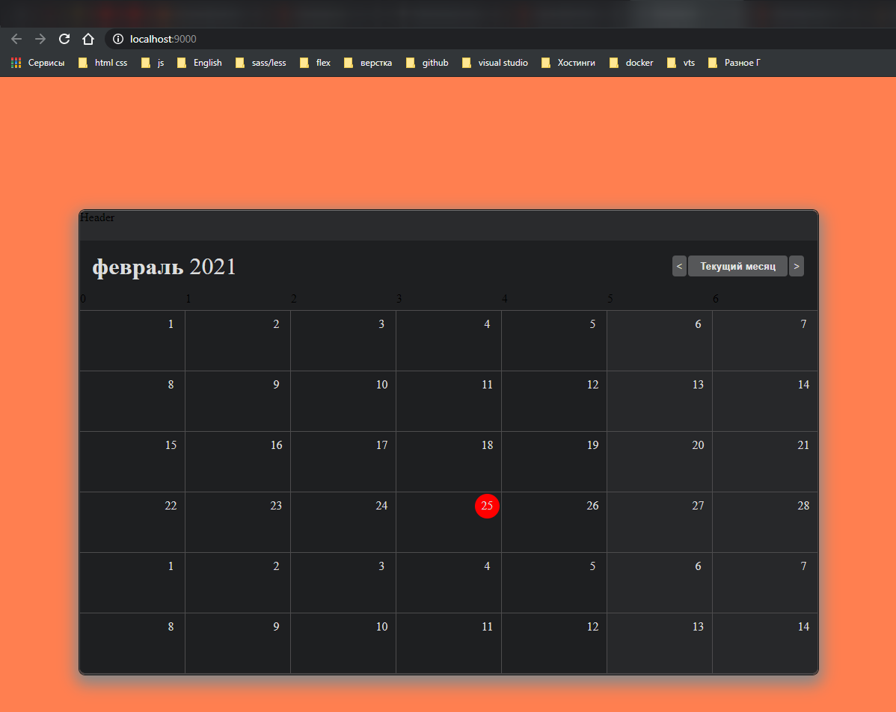

Для себя. Если работа с датами то только с **moment.js**. Но на собесах будут дрючить так что переодически практикуйся с **Date()**.

Смотри day of week [https://momentjs.com/docs/#/get-set/day/](https://momentjs.com/docs/#/get-set/day/).

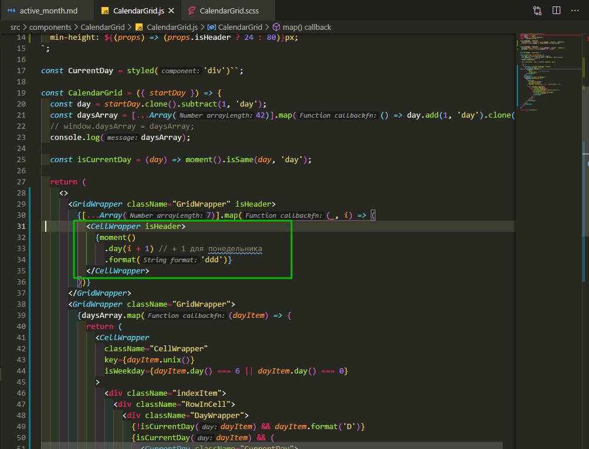

```jsx
//components/CalendarGrid/CalendarGrid.js
import moment from 'moment';
import React from 'react';
import styled from 'styled-components';
import './CalendarGrid.scss';

const GridWrapper = styled.div`
  background-color: ${(props) => (props.isHeader ? '#1e1f21' : '#4d4c4d')};
  ${(props) => props.isHeader && 'border-bottom: 1px solid #4d4c4d'}
`;

const CellWrapper = styled.div`
  background-color: ${(props) => (props.isWeekday ? '#27282A' : '#1E1F21')};
  min-height: ${(props) => (props.isHeader ? 24 : 80)}px;
`;

const CurrentDay = styled('div')``;

const CalendarGrid = ({ startDay }) => {
  const day = startDay.clone().subtract(1, 'day');
  const daysArray = [...Array(42)].map(() => day.add(1, 'day').clone());
  // window.daysArray = daysArray;
  console.log(daysArray);

  const isCurrentDay = (day) => moment().isSame(day, 'day');

  return (
    <>
      <GridWrapper className="GridWrapper" isHeader>
        {[...Array(7)].map((_, i) => (
          <CellWrapper isHeader>
            {moment()
              .day(i + 1) // + 1 для понедельника
              .format('ddd')}
          </CellWrapper>
        ))}
      </GridWrapper>
      <GridWrapper className="GridWrapper">
        {daysArray.map((dayItem) => {
          return (
            <CellWrapper
              className="CellWrapper"
              key={dayItem.unix()}
              isWeekday={dayItem.day() === 6 || dayItem.day() === 0}
            >
              <div className="indexItem">
                <div className="RowInCell">
                  <div className="DayWrapper">
                    {!isCurrentDay(dayItem) && dayItem.format('D')}
                    {isCurrentDay(dayItem) && (
                      <CurrentDay className="CurrentDay">
                        {dayItem.format('D')}
                      </CurrentDay>
                    )}
                  </div>
                </div>
              </div>
            </CellWrapper>
          );
        })}
      </GridWrapper>
    </>
  );
};

export default CalendarGrid;
```

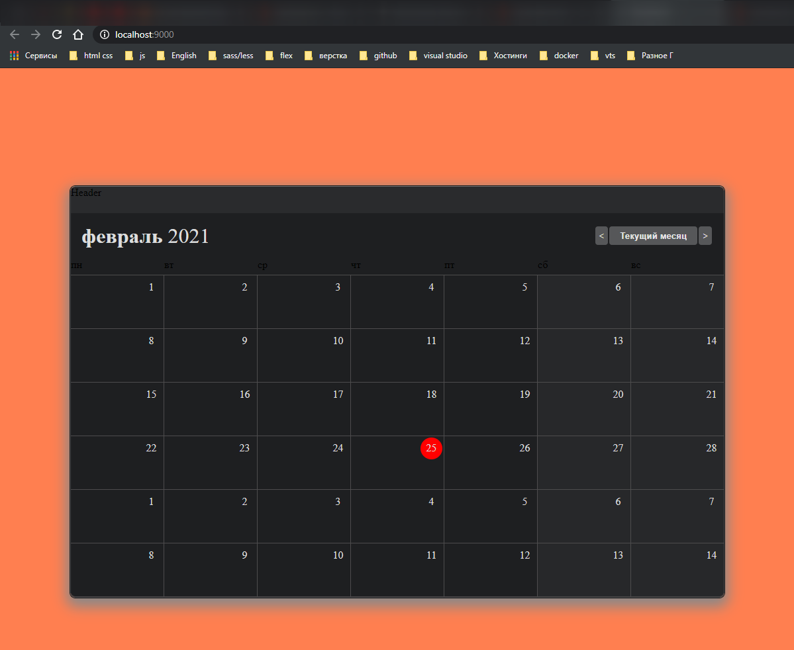

И так далее позиционирую. Для этого я могу бернуть вывод в уже имеющийся **div** c классом **RowInCell** и далее добавить допустим класс **DayColor**.

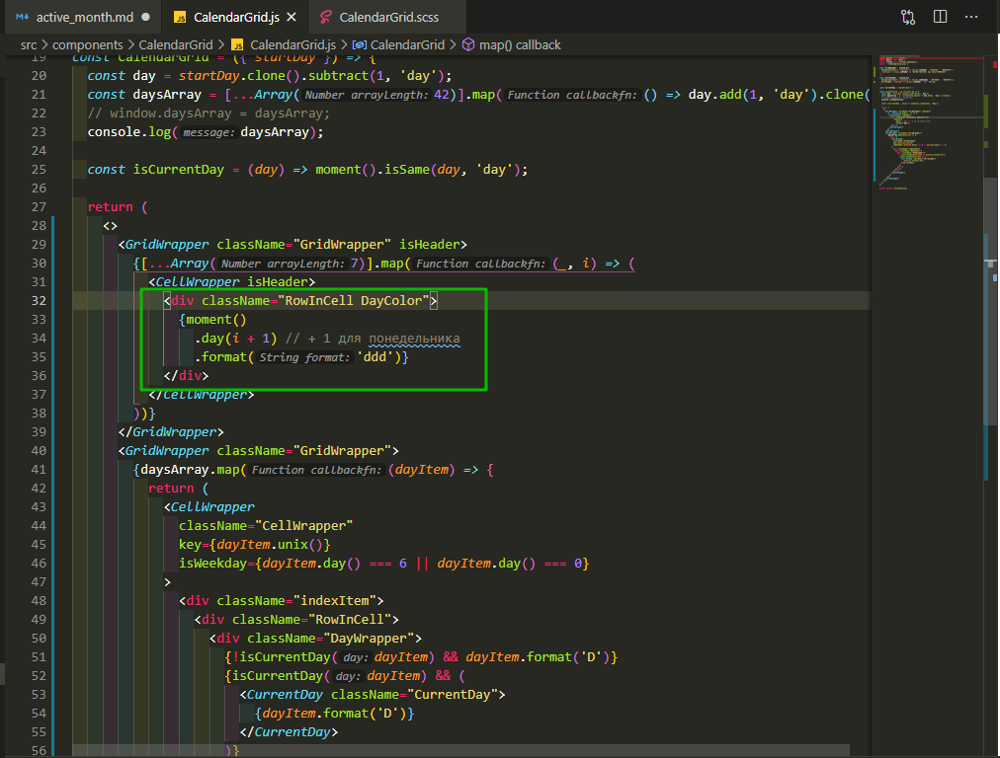

```jsx
//components/CalendarGrid/CalendarGrid.js
import moment from 'moment';
import React from 'react';
import styled from 'styled-components';
import './CalendarGrid.scss';

const GridWrapper = styled.div`
  background-color: ${(props) => (props.isHeader ? '#1e1f21' : '#4d4c4d')};
  ${(props) => props.isHeader && 'border-bottom: 1px solid #4d4c4d'}
`;

const CellWrapper = styled.div`
  background-color: ${(props) => (props.isWeekday ? '#27282A' : '#1E1F21')};
  min-height: ${(props) => (props.isHeader ? 24 : 80)}px;
`;

const CurrentDay = styled('div')``;

const CalendarGrid = ({ startDay }) => {
  const day = startDay.clone().subtract(1, 'day');
  const daysArray = [...Array(42)].map(() => day.add(1, 'day').clone());
  // window.daysArray = daysArray;
  console.log(daysArray);

  const isCurrentDay = (day) => moment().isSame(day, 'day');

  return (
    <>
      <GridWrapper className="GridWrapper" isHeader>
        {[...Array(7)].map((_, i) => (
          <CellWrapper isHeader>
            <div className="RowInCell DayColor">
              {moment()
                .day(i + 1) // + 1 для понедельника
                .format('ddd')}
            </div>
          </CellWrapper>
        ))}
      </GridWrapper>
      <GridWrapper className="GridWrapper">
        {daysArray.map((dayItem) => {
          return (
            <CellWrapper
              className="CellWrapper"
              key={dayItem.unix()}
              isWeekday={dayItem.day() === 6 || dayItem.day() === 0}
            >
              <div className="indexItem">
                <div className="RowInCell">
                  <div className="DayWrapper">
                    {!isCurrentDay(dayItem) && dayItem.format('D')}
                    {isCurrentDay(dayItem) && (
                      <CurrentDay className="CurrentDay">
                        {dayItem.format('D')}
                      </CurrentDay>
                    )}
                  </div>
                </div>
              </div>
            </CellWrapper>
          );
        })}
      </GridWrapper>
    </>
  );
};

export default CalendarGrid;
```

```scss
//components/CalendarGrid/CalendarGrid.scss
.GridWrapper {
  display: grid;
  grid-template-columns: repeat(7, 1fr); // разбиваю на колонки
  // grid-template-rows: repeat(6, 1fr);
  grid-gap: 1px; // зазор между ячейками
  background-color: #404040; // цвет подложки
}
.CellWrapper {
  // min-height: 80px;
  min-width: 140px;
  background-color: #1e1f21;
  color: #dddcdd;
}
.DayColor {
  color: yellow;
  font-size: 20px;
}

.RowInCell {
  display: flex;
  justify-content: flex-end;
}
.DayWrapper {
  height: 33px;
  width: 33px;
  display: flex;
  align-items: center;
  justify-content: center;
  margin: 2px;
  // outline: 1px solid green;
}

.CurrentDay {
  height: 100%;
  width: 100%;
  background-color: #f00;
  border-radius: 50%;
  display: flex;
  justify-content: center;
  align-items: center;
}
```
