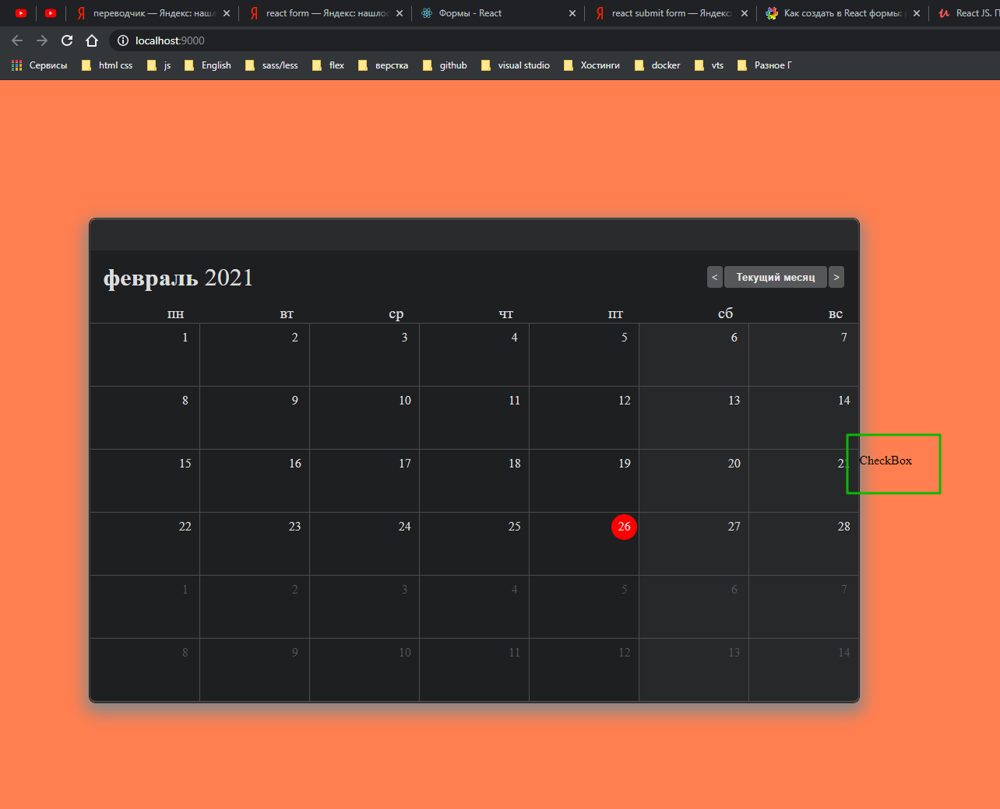
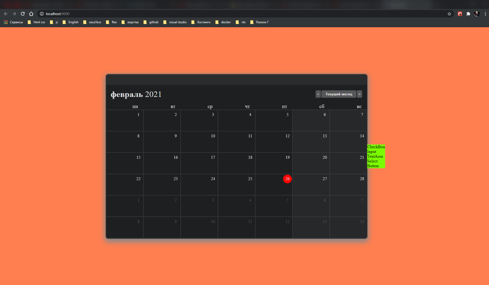

# React Form

1. Структурирование формы.

> Данные компоненты можно использовать повторно.

На одной иерархии создаю папку containers которая будет отвечать за логику.

И создаю данный файл FormContainer.js. Данный компонент будет классовым. Но перед этим создам так называемые немые компонент которые импортирую в FormContainer.js.

```jsx
//components/CheckBox/CheckBox.js
import React from 'react';
import './CheckBox.scss';

const CheckBox = () => {
  return <div>CheckBox</div>;
};

export default CheckBox;
```

```jsx
//components/CheckBox/index.js
import CheckBox from './CheckBox';

export default CheckBox;
```

Далее классовый компонент где будет вя логика

```jsx
// containers/FormContainer/FormContainer.js
import React from 'react';
import { Component } from 'react';

import CheckBox from '../../components/Form/CheckBox';

export default class FormContainer extends Component {
  constructor(props) {
    super(props);
    this.state = {};
  }

  render() {
    return <CheckBox />;
  }
}
```

```jsx
// containers/FormContainer/index.js
import FormContainer from './FormContainer';

export default FormContainer;
```

И потом естественно импортирую в главный компонент для отображения

```jsx
//components/app/App.js
import React from 'react';
import moment from 'moment';
import styled from 'styled-components';

import Header from '../Calendar/Header';
import Monitor from '../Calendar/Monitor';
import CalendarGrid from '../Calendar/CalendarGrid';

import FormContainer from '../../containers/FormContainer';

import './App.scss';

const ShadowWrapper = styled('div')``;

function App() {
  moment.updateLocale('ru', { week: { down: 1 } });
  // const today = moment();
  const [today, setToday] = React.useState(moment());
  const startDay = today.clone().startOf('month').startOf('week');

  window.moment = moment;

  const prevHandler = () => {
    setToday((prev) => prev.clone().subtract(1, 'month'));
  };
  const todayHandler = () => {
    setToday(moment());
  };
  const nextHandler = () => {
    setToday((prev) => prev.clone().add(1, 'month'));
  };

  return (
    <>
      <ShadowWrapper className="ShadowWrapper">
        <Header />
        <Monitor
          today={today}
          prevHandler={prevHandler}
          todayHandler={todayHandler}
          nextHandler={nextHandler}
        />
        <CalendarGrid startDay={startDay} today={today} />
      </ShadowWrapper>
      <FormContainer />
    </>
  );
}

export default App;
```



Добавляю остальные компоненты

```jsx
//components/Input/Input.js
import React from 'react';
import './Input.scss';

const Input = () => {
  return <div>Input</div>;
};

export default Input;
```

```jsx
//components/Input/index.js

import Input from './Input';

export default Input;
```

```jsx
// components/TextArea/TextArea.js
import React from 'react';
import './TextArea.scss';

const TextArea = () => {
  return <div>TextArea</div>;
};

export default TextArea;
```

```jsx
// components/TextArea/index.js
import TextArea from './TextArea';

export default TextArea;
```

```jsx
//components/Select/Select.js
import React from 'react';
import './Select.scss';

const Select = () => {
  return <div>Select</div>;
};

export default Select;
```

```jsx
//components/Select/index.js
import Select from './Select';

export default Select;
```

```jsx
//components/Button/Button.js
import React from 'react';
import './Button.scss';

const Button = () => {
  return <div>Button</div>;
};

export default Button;
```

```jsx
//components/Button/index.js
import Button from './Button';

export default Button;
```

```jsx
// containers/FormContainer/FormContainer.js
import React from 'react';
import { Component } from 'react';

import './FormContainer.scss';

import CheckBox from '../../components/Form/CheckBox';
import Input from '../../components/Form/Input';
import TextArea from '../../components/Form/TextArea';
import Select from '../../components/Form/Select';
import Button from '../../components/Form/Button';

export default class FormContainer extends Component {
  constructor(props) {
    super(props);
    this.state = {};
  }

  render() {
    return (
      <form>
        <CheckBox />
        <Input />
        <TextArea />
        <Select />
        <Button />
      </form>
    );
  }
}
```



И так все коппоненты выводятся.

Добавляю state и две функции обработки и очиски формы.

```jsx
// containers/FormContainer/FormContainer.js
import React from 'react';
import { Component } from 'react';

import './FormContainer.scss';

import CheckBox from '../../components/Form/CheckBox';
import Input from '../../components/Form/Input';
import TextArea from '../../components/Form/TextArea';
import Select from '../../components/Form/Select';
import Button from '../../components/Form/Button';

export default class FormContainer extends Component {
  constructor(props) {
    super(props);
    this.state = {
      newFormValue: {
        Q1: '',
        Q2: '',
        T1: '',
        T2: '',
        V1: '',
        V2: '',
        M1: '',
        M2: '',
        work_device: '',
        work_device_error: '',
        exampleFormControlTextarea1: '',
      },
    };
    this.handleFormSubmit = this.handleFormSubmit.bind(this);
    this.handleClearForm = this.handleClearForm.bind(this);
  }

  handleFormSubmit() {
    // Form submission logic
  }
  handleClearForm() {
    // Logic for resetting the form
  }

  render() {
    return (
      <form>
        <CheckBox />
        <Input />
        <TextArea />
        <Select />
        <Button />
      </form>
    );
  }
}
```

Смотри далее.
