# Шапка календаря.

1. Чутка работаю со стилями.

```scss
// App.scss
* {
  box-sizing: border-box;
}

html,
body {
  margin: 0;
  padding: 0;
}
body {
  background-color: coral;
}

#root {
  height: 100vh;
  display: flex;
  align-items: center;
  justify-content: center;
}
```

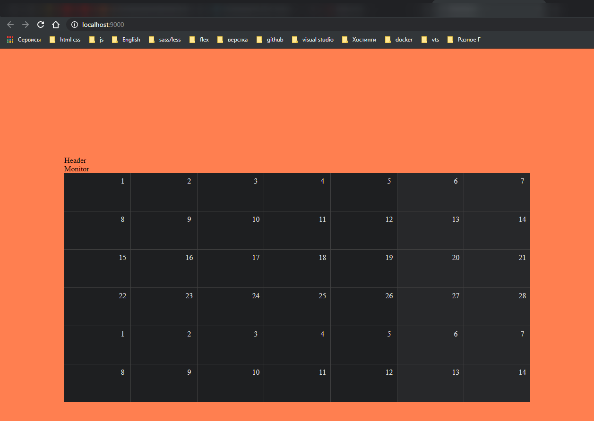

2. **CALENDAR WRAPPER** Делаю контейнет для календаря с тенями и др фишками.

Вот это вот собственно и будет контейнером для нашего календаря.

```jsx
//components/app/App.js
import React from 'react';

// components/app/App.js
import moment from 'moment';

import Header from '../Header';
import Monitor from '../Monitor';
import CalendarGrid from '../CalendarGrid';

import './App.scss';

moment.updateLocale('ru', { week: { down: 1 } });
const startDay = moment().startOf('month').startOf('week');

const App = () => {
  return (
    <div>
      <Header />
      <Monitor />
      <CalendarGrid startDay={startDay} />
    </div>
  );
};

export default App;
```

Кароче для более нормального отображения пришел к выводу что буду создавать и **styled-components** после чего прописывать ему класс **css** с таким же именем. И инлайновые стили буду использовать лиш в специцических ситуация. Да и отображение компонета более понятнее чем огромное количество вложенных **div**.

```jsx
//components/app/App.js
import React from 'react';

import moment from 'moment';
import styled from 'styled-components';

import Header from '../Header';
import Monitor from '../Monitor';
import CalendarGrid from '../CalendarGrid';

const ShadowWrapper = styled('div')``;

import './App.scss';

moment.updateLocale('ru', { week: { down: 1 } });
const startDay = moment().startOf('month').startOf('week');

const App = () => {
  return (
    <ShadowWrapper className="ShadowWrapper">
      <Header />
      <Monitor />
      <CalendarGrid startDay={startDay} />
    </ShadowWrapper>
  );
};

export default App;
```

```scss
// App.scss
* {
  box-sizing: border-box;
}
html,
body {
  margin: 0;
  padding: 0;
}
body {
  background-color: coral;
}

#root {
  height: 100vh;
  display: flex;
  align-items: center;
  justify-content: center;
}

.ShadowWrapper {
  border-radius: 8px;
  border: 3px solid lime;
  overflow: hidden; // Переполняющее содержимое не отображается
}
```

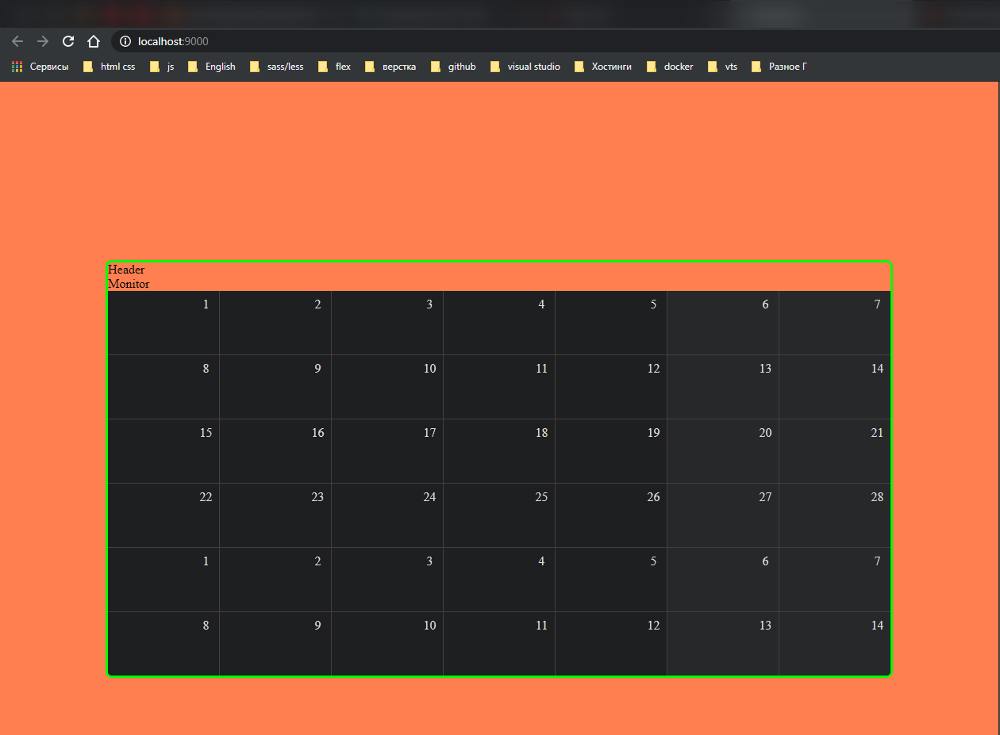

Здесь есть **border**. Заморочился.

```scss
// App.scss
* {
  box-sizing: border-box;
}
html,
body {
  margin: 0;
  padding: 0;
}
body {
  background-color: coral;
}

#root {
  height: 100vh;
  display: flex;
  align-items: center;
  justify-content: center;
}

.ShadowWrapper {
  border-radius: 8px;
  border-top: 1px solid #737374;
  border-left: 1px solid #464648;
  border-right: 1px solid #464648;
  border-bottom: 2px solid #464648;
  box-shadow: 0 0 0 1px #1a1a1a, 0 8px 20px 6px #888;
  overflow: hidden; // Переполняющее содержимое не отображается
}
```

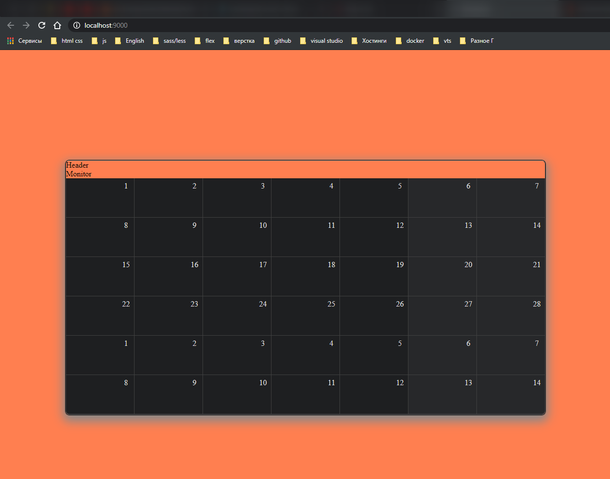

<br>
<br>
<hr>

3. Шапка календаря. Компонент **MONITOR**.

- И так здесь должен быть блок в котором написан месяц и год.
- Блок переключения месяца.

```jsx
import React from 'react';
import './Monitor.scss';

const Monitor = () => {
  return (
    <div>
      <div>
        <div>December</div>
        <div>2021</div>
      </div>
      <div></div>
    </div>
  );
};

export default Monitor;
```

А в блоке переключения месяца будет 3-ри **ctrl**, **preview**, **next**, **current**(месяц в котором находится текущий день).

```jsx
import React from 'react';
import './Monitor.scss';

const Monitor = () => {
  return (
    <div>
      <div>
        <div>December</div>
        <div>2021</div>
      </div>
      <button>-</button>
      <button>today</button>
      <button>+</button>
    </div>
  );
};

export default Monitor;
```

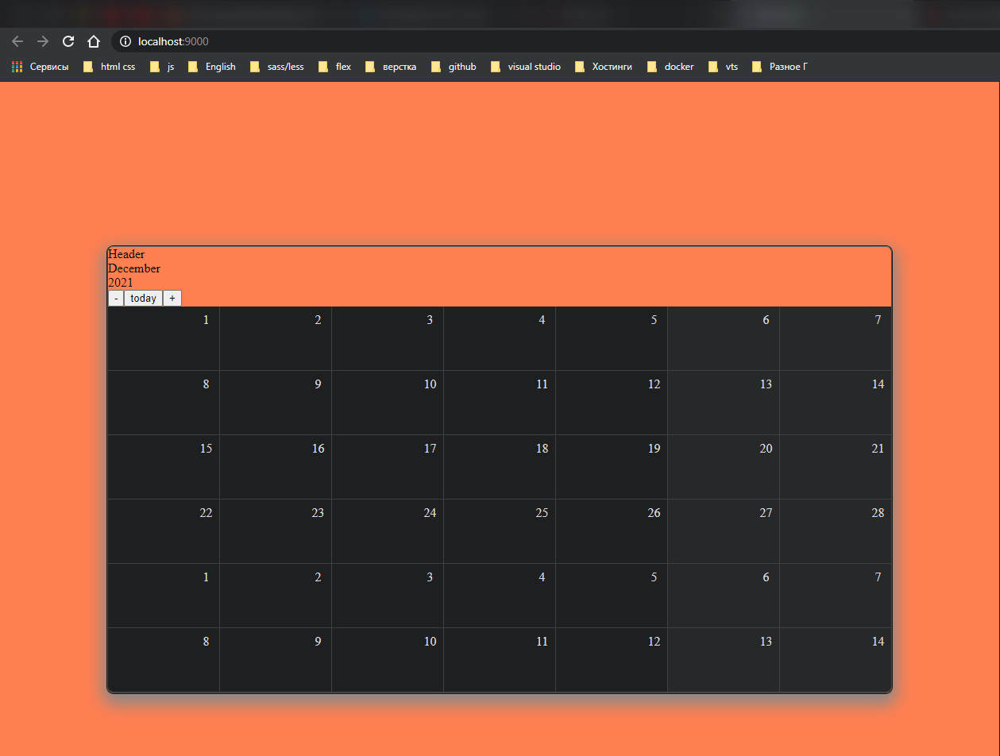

```jsx
import React from 'react';
import styled from 'styled-components';
import './Monitor.scss';

const divWrapper = styled('div')``;

const Monitor = () => {
  return (
    <divWrapper className="divWrapper">
      <div>
        <span>December</span>
        <span>2021</span>
      </div>
      <div>
        <button>-</button>
        <button>today</button>
        <button>+</button>
      </div>
    </divWrapper>
  );
};

export default Monitor;
```

```scss
// Monitor.scss
.divWrapper {
  display: flex;
  justify-content: space-between;
  background-color: #1e1f21;
  color: #dcdddd;
}
```

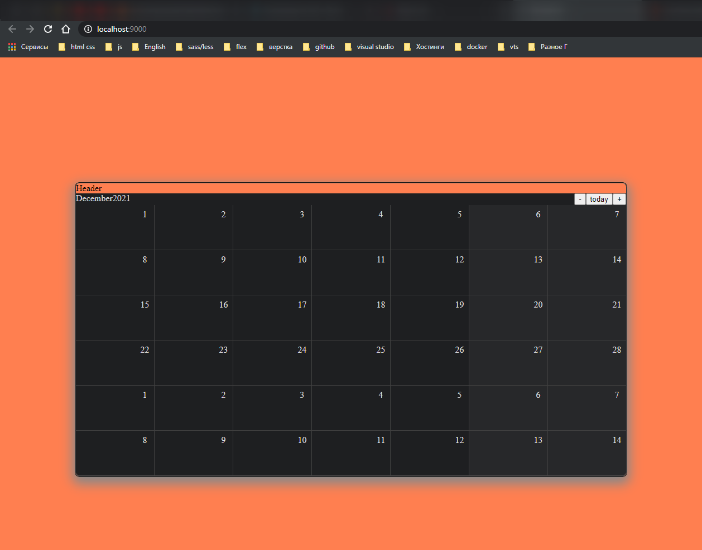

```scss
// Monitor.scss
.divWrapper {
  display: flex;
  justify-content: space-between;
  background-color: #1e1f21;
  color: #dcdddd;
}

.divWrapper {
  padding: 16px;
  span {
    font-size: 32px;
  }
}

.divWrapperMonth {
  font-weight: bold;
  margin-right: 8px;
}
```

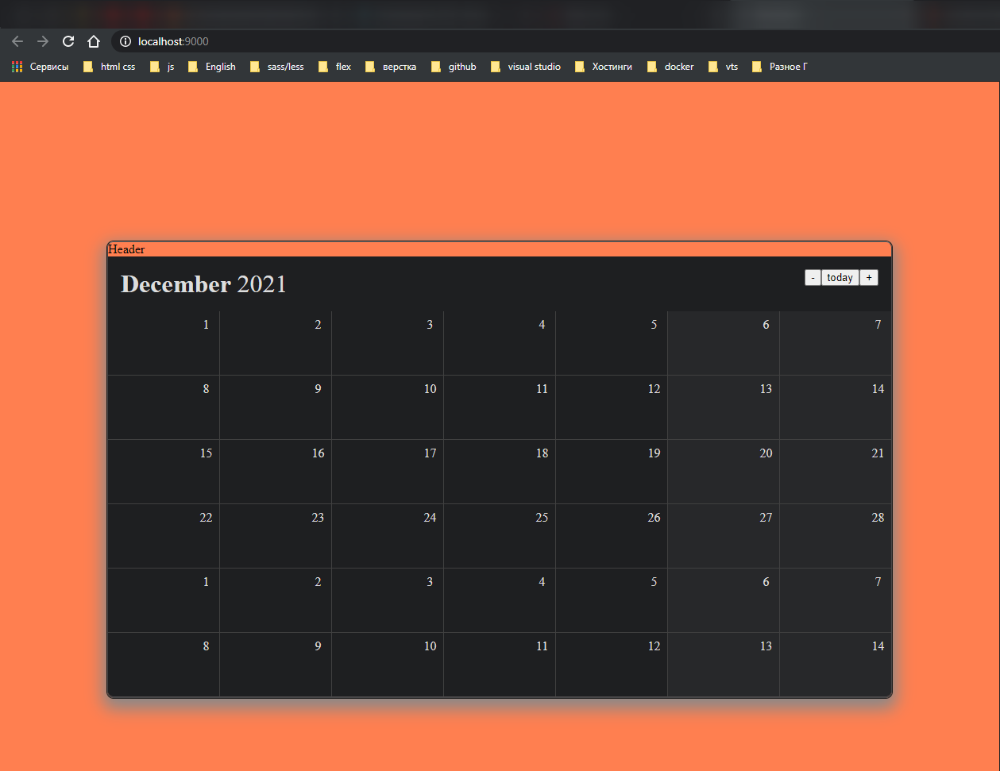

Теперь занимаюсь кнопками. Добавляю спецсимволы **\&lt;** и **\&gt;**

```jsx
import React from 'react';
import styled from 'styled-components';
import './Monitor.scss';

const divWrapper = styled('div')``;

const Monitor = () => {
  return (
    <divWrapper className="divWrapper">
      <div>
        <span className="divWrapperMonth">December</span>
        <span>2021</span>
      </div>
      <div>
        <button>&lt;</button>
        <button>today</button>
        <button>&gt;</button>
      </div>
    </divWrapper>
  );
};

export default Monitor;
```

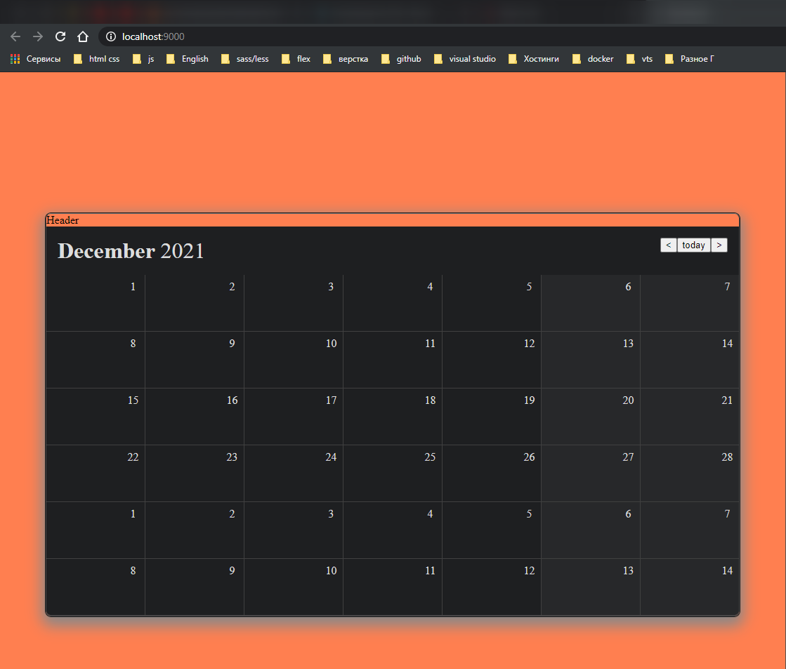

Стили для кнопки

```jsx
import React from 'react';
import styled from 'styled-components';
import './Monitor.scss';

const divWrapper = styled('div')``;

const Monitor = () => {
  return (
    <divWrapper className="divWrapper">
      <div>
        <span className="divWrapperMonth">December</span>
        <span>2021</span>
      </div>
      <div>
        <button className="ButtonWrapper">&lt;</button>
        <button className="ButtonWrapper">today</button>
        <button className="ButtonWrapper">&gt;</button>
      </div>
    </divWrapper>
  );
};

export default Monitor;
```

```scss
// Monitor.scss
.divWrapper {
  display: flex;
  justify-content: space-between;
  background-color: #1e1f21;
  color: #dcdddd;
}

.divWrapper {
  padding: 16px;
  span {
    font-size: 32px;
  }
}

.divWrapperMonth {
  font-weight: bold;
  margin-right: 8px;
}

.ButtonWrapper {
  border: unset;
  background-color: #565759;
  height: 28px;
  margin-right: 2px;
  border-radius: 4px;
  color: #e6e6e6;
}
```

Стили для **TodayButton**

```jsx
import React from 'react';
import styled from 'styled-components';
import './Monitor.scss';

const divWrapper = styled('div')``;

const Monitor = () => {
  return (
    <divWrapper className="divWrapper">
      <div>
        <span className="divWrapperMonth">December</span>
        <span>2021</span>
      </div>
      <div>
        <button className="ButtonWrapper">&lt;</button>
        <button className="ButtonWrapper TodayButton">today</button>
        <button className="ButtonWrapper">&gt;</button>
      </div>
    </divWrapper>
  );
};

export default Monitor;
```

```scss
// Monitor.scss
.divWrapper {
  display: flex;
  justify-content: space-between;
  background-color: #1e1f21;
  color: #dcdddd;
}

.divWrapper {
  padding: 16px;
  span {
    font-size: 32px;
  }
}

.divWrapperMonth {
  font-weight: bold;
  margin-right: 8px;
}

.ButtonWrapper {
  border: unset;
  background-color: #565759;
  height: 28px;
  margin-right: 2px;
  border-radius: 4px;
  color: #e6e6e6;
}

.TodayButton {
  padding-right: 16px;
  padding-left: 16px;
  font-weight: bold;
}
```

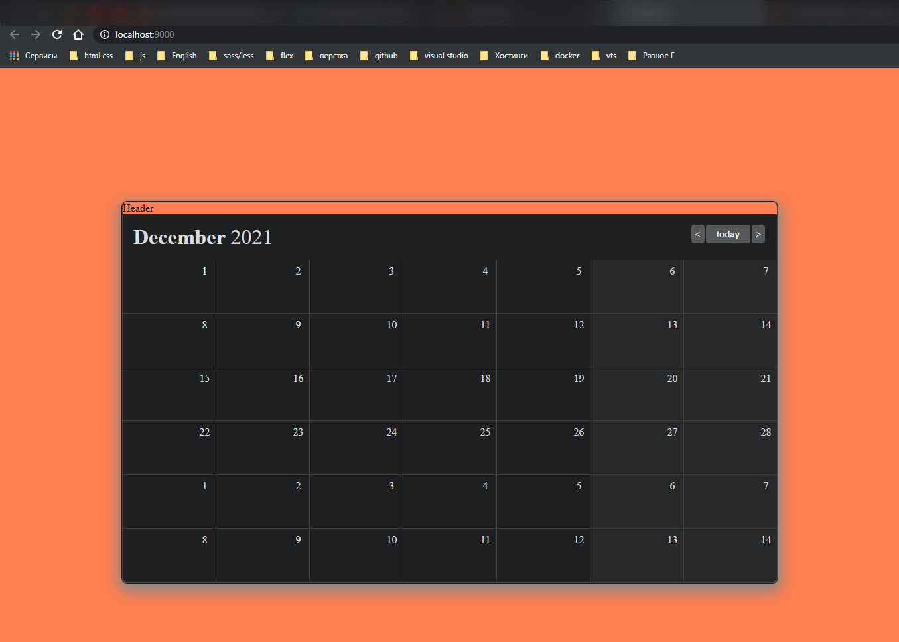

<br>
<br>
<hr>

4. TITLE

```jsx
import React from 'react';
import styled from 'styled-components';
import './Header.scss';

const DivWrapper = styled('div')``;

const Header = () => {
  return <DivWrapper className="DivWrapper">Header</DivWrapper>;
};

export default Header;
```

```scss
.DivWrapper {
  background-color: #2a2b2d;
  height: 40px;
}
```

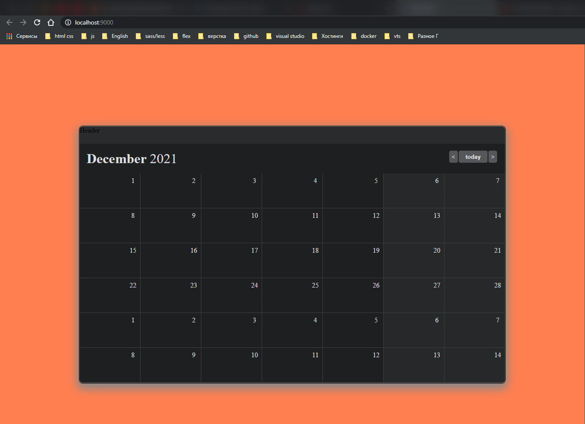

<br>
<br>
<hr>

5. Пилю логику.

В компонент **Monitor** нужно передавать значения месяца и года. Назад глобально подключаю библиотеку.

```jsx
//components/app/App.js
import React from 'react';
import momemt from 'moment';
import moment from 'moment';
import styled from 'styled-components';

import Header from '../Header';
import Monitor from '../Monitor';
import CalendarGrid from '../CalendarGrid';

const ShadowWrapper = styled('div')``;

import './App.scss';

moment.updateLocale('ru', { week: { down: 1 } });
const startDay = moment().startOf('month').startOf('week');

window.moment = moment;

const App = () => {
  return (
    <ShadowWrapper className="ShadowWrapper">
      <Header />
      <Monitor />
      <CalendarGrid startDay={startDay} />
    </ShadowWrapper>
  );
};

export default App;
```

Иду в **devTools** и вывожу месяц

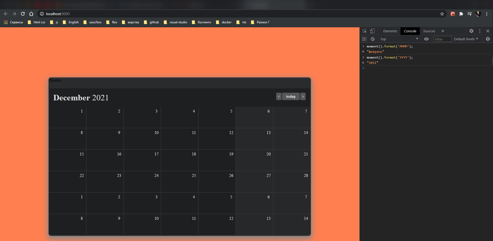

И так создаю инстанс текущего дня в **App.js**

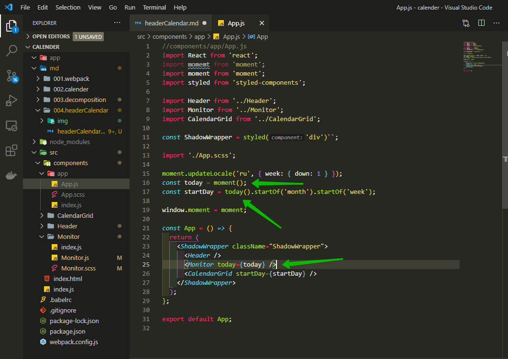

```jsx
//components/app/App.js
import React from 'react';
import moment from 'moment';
import moment from 'moment';
import styled from 'styled-components';

import Header from '../Header';
import Monitor from '../Monitor';
import CalendarGrid from '../CalendarGrid';

const ShadowWrapper = styled('div')``;

import './App.scss';

moment.updateLocale('ru', { week: { down: 1 } });
const today = moment();
const startDay = today().startOf('month').startOf('week');

window.moment = moment;

const App = () => {
  return (
    <ShadowWrapper className="ShadowWrapper">
      <Header />
      <Monitor today={today} />
      <CalendarGrid startDay={startDay} />
    </ShadowWrapper>
  );
};

export default App;
```

И теперь отлавливаю данные значения в **Monitor.js** Так немного в компонентах переписал код т.е. именование классов. А вот код логики вывода месяца и года.

```jsx
//components/app/App.js
import React from 'react';
import moment from 'moment';
import styled from 'styled-components';

import Header from '../Header';
import Monitor from '../Monitor';
import CalendarGrid from '../CalendarGrid';

const ShadowWrapper = styled('div')``;

import './App.scss';

moment.updateLocale('ru', { week: { down: 1 } });
const today = moment();
const startDay = today.startOf('month').startOf('week');

window.moment = moment;

const App = () => {
  return (
    <ShadowWrapper className="ShadowWrapper">
      <Header />
      <Monitor today={today} />
      <CalendarGrid startDay={startDay} />
    </ShadowWrapper>
  );
};

export default App;
```

```jsx
import React from 'react';
import styled from 'styled-components';
import './Monitor.scss';

const DivWrapper = styled('div')``;

const Monitor = ({ today }) => {
  return (
    <DivWrapper className="DivWrapper">
      <div>
        <span className="DivWrapperMonth">{today.format('MMMM')}</span>
        <span>{today.format('YYYY')}</span>
      </div>
      <div>
        <button className="ButtonWrapper">&lt;</button>
        <button className="ButtonWrapper TodayButton">today</button>
        <button className="ButtonWrapper">&gt;</button>
      </div>
    </DivWrapper>
  );
};

export default Monitor;
```

Однако хоть и не видно, но вот здесь происходит мутация **const startDay = today.startOf('month').startOf('week');**. Необходимо склонировать **const startDay = today.clone().startOf('month').startOf('week');**

```jsx
//components/app/App.js
import React from 'react';
import moment from 'moment';
import styled from 'styled-components';

import Header from '../Header';
import Monitor from '../Monitor';
import CalendarGrid from '../CalendarGrid';

const ShadowWrapper = styled('div')``;

import './App.scss';

moment.updateLocale('ru', { week: { down: 1 } });
const today = moment();
const startDay = today.clone().startOf('month').startOf('week');

window.moment = moment;

const App = () => {
  return (
    <ShadowWrapper className="ShadowWrapper">
      <Header />
      <Monitor today={today} />
      <CalendarGrid startDay={startDay} />
    </ShadowWrapper>
  );
};

export default App;
```
