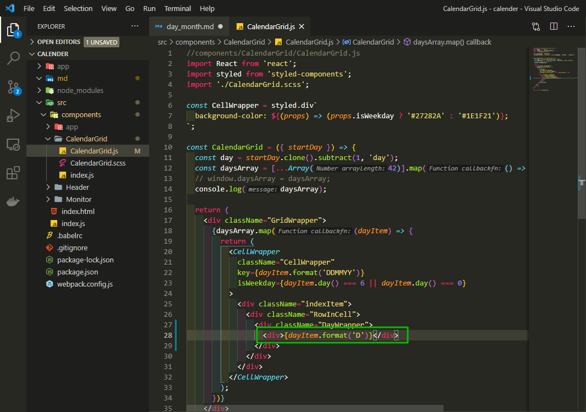
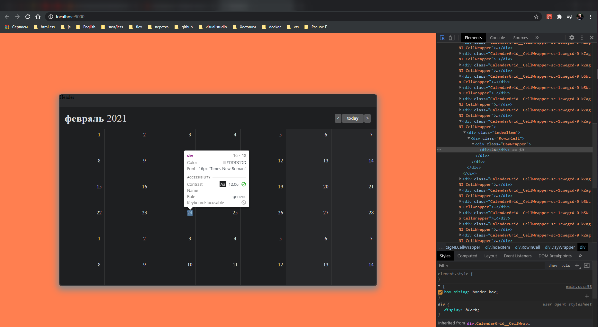
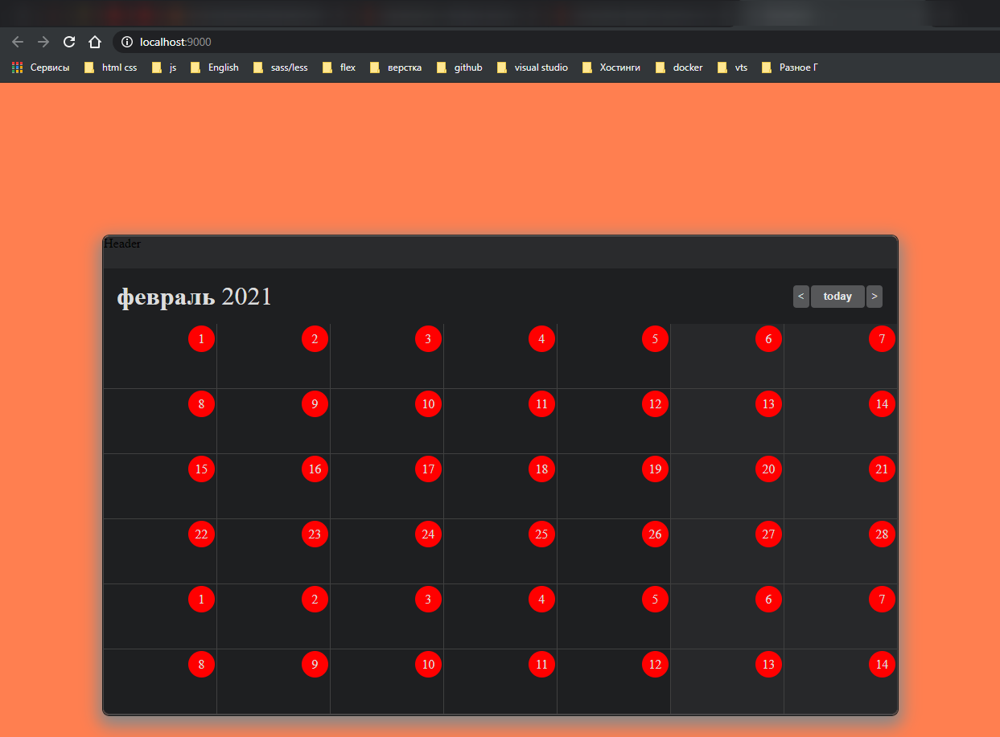
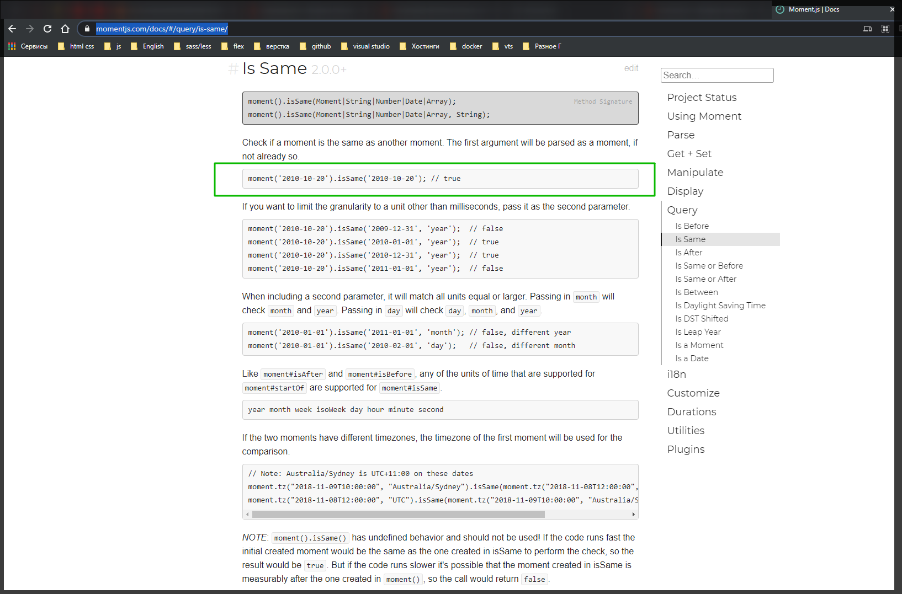
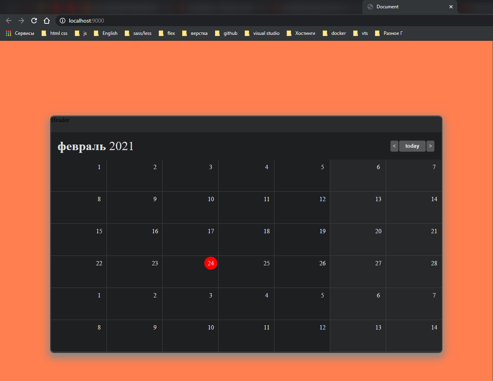

# Подсветка дня. Переключение месяца.

Сделаю переключение месяцев и подсветку current текущий день.

Начну с текущего дня. мне его нужно отобразить в сетке календаря. И так в разметку добавляю дополнительный div.



```jsx
//components/CalendarGrid/CalendarGrid.js
import React from 'react';
import styled from 'styled-components';
import './CalendarGrid.scss';

const CellWrapper = styled.div`
  background-color: ${(props) => (props.isWeekday ? '#27282A' : '#1E1F21')};
`;

const CalendarGrid = ({ startDay }) => {
  const day = startDay.clone().subtract(1, 'day');
  const daysArray = [...Array(42)].map(() => day.add(1, 'day').clone());
  // window.daysArray = daysArray;
  console.log(daysArray);

  return (
    <div className="GridWrapper">
      {daysArray.map((dayItem) => {
        return (
          <CellWrapper
            className="CellWrapper"
            key={dayItem.format('DDMMYY')}
            isWeekday={dayItem.day() === 6 || dayItem.day() === 0}
          >
            <div className="indexItem">
              <div className="RowInCell">
                <div className="DayWrapper">
                  <div>{dayItem.format('D')}</div>
                </div>
              </div>
            </div>
          </CellWrapper>
        );
      })}
    </div>
  );
};

export default CalendarGrid;
```



И вешаю стили на данный элемент.

```jsx
//components/CalendarGrid/CalendarGrid.js
import React from 'react';
import styled from 'styled-components';
import './CalendarGrid.scss';

const CellWrapper = styled.div`
  background-color: ${(props) => (props.isWeekday ? '#27282A' : '#1E1F21')};
`;

const CurrentDay = styled('div')``;

const CalendarGrid = ({ startDay }) => {
  const day = startDay.clone().subtract(1, 'day');
  const daysArray = [...Array(42)].map(() => day.add(1, 'day').clone());
  // window.daysArray = daysArray;
  console.log(daysArray);

  return (
    <div className="GridWrapper">
      {daysArray.map((dayItem) => {
        return (
          <CellWrapper
            className="CellWrapper"
            key={dayItem.format('DDMMYY')}
            isWeekday={dayItem.day() === 6 || dayItem.day() === 0}
          >
            <div className="indexItem">
              <div className="RowInCell">
                <div className="DayWrapper">
                  <CurrentDay className="CurrentDay">
                    {dayItem.format('D')}
                  </CurrentDay>
                </div>
              </div>
            </div>
          </CellWrapper>
        );
      })}
    </div>
  );
};

export default CalendarGrid;
```

```scss
//components/CalendarGrid/CalendarGrid.scss
.GridWrapper {
  display: grid;
  grid-template-columns: repeat(7, 1fr); // разбиваю на колонки
  grid-template-rows: repeat(6, 1fr);
  grid-gap: 1px; // зазор между ячейками
  background-color: #404040; // цвет подложки
}
.CellWrapper {
  min-width: 140px;
  min-height: 80px;
  background-color: #1e1f21;
  color: #dddcdd;
}

.RowInCell {
  display: flex;
  justify-content: flex-end;
}
.DayWrapper {
  height: 33px;
  width: 33px;
  display: flex;
  align-items: center;
  justify-content: center;
  margin: 2px;
  // outline: 1px solid green;
}

.CurrentDay {
  height: 100%;
  width: 100%;
  background-color: #f00;
  border-radius: 50%;
  display: flex;
  justify-content: center;
  align-items: center;
}
```



Теперь наша задача сделать так что бы текущий день был действительно текущим днем.

Создаю функцию isCurrentDay = (day) =>{}. В теле цикла должно быть возвращено булево значение.

В DayWrapper пишу условие в фигурных скобках {!isCurrentDay(dayItem) && dayItem.format('D')} Это если не является текущим днем.

А если является текущим днем, то {isCurrentDay(dayItem) && \<CurrentDay className="CurrentDay">{dayItem.format('D')}</CurrentDay>}.

```jsx
//components/CalendarGrid/CalendarGrid.js
import React from 'react';
import styled from 'styled-components';
import './CalendarGrid.scss';

const CellWrapper = styled.div`
  background-color: ${(props) => (props.isWeekday ? '#27282A' : '#1E1F21')};
`;

const CurrentDay = styled('div')``;

const CalendarGrid = ({ startDay }) => {
  const day = startDay.clone().subtract(1, 'day');
  const daysArray = [...Array(42)].map(() => day.add(1, 'day').clone());
  // window.daysArray = daysArray;
  console.log(daysArray);

  const isCurrentDay = (day) => true;

  return (
    <div className="GridWrapper">
      {daysArray.map((dayItem) => {
        return (
          <CellWrapper
            className="CellWrapper"
            key={dayItem.format('DDMMYY')}
            isWeekday={dayItem.day() === 6 || dayItem.day() === 0}
          >
            <div className="indexItem">
              <div className="RowInCell">
                <div className="DayWrapper">
                  {!isCurrentDay(dayItem) && dayItem.format('D')}
                  {isCurrentDay(dayItem) && (
                    <CurrentDay className="CurrentDay">
                      {dayItem.format('D')}
                    </CurrentDay>
                  )}
                </div>
              </div>
            </div>
          </CellWrapper>
        );
      })}
    </div>
  );
};

export default CalendarGrid;
```

Теперь пишу саму функцию isCurrentDay. Для этого нужно залезть в moment. В документации захожу в раздел isSame [https://momentjs.com/docs/#/query/is-same/](https://momentjs.com/docs/#/query/is-same/). И она будет проверять является ли одна часть выражения такой же как и другая.



И теперь мы можем передавать что конкретно мы сравниваем. const isCurrentDay = (day) => moment().isSame() и в isSame я передаю day, и вторым аргументом я передаю строковое значение то с чем буду сравнивать 'day'.

```jsx
//components/CalendarGrid/CalendarGrid.js
import moment from 'moment';
import React from 'react';
import styled from 'styled-components';
import './CalendarGrid.scss';

const CellWrapper = styled.div`
  background-color: ${(props) => (props.isWeekday ? '#27282A' : '#1E1F21')};
`;

const CurrentDay = styled('div')``;

const CalendarGrid = ({ startDay }) => {
  const day = startDay.clone().subtract(1, 'day');
  const daysArray = [...Array(42)].map(() => day.add(1, 'day').clone());
  // window.daysArray = daysArray;
  console.log(daysArray);

  const isCurrentDay = (day) => moment().isSame(day, 'day');

  return (
    <div className="GridWrapper">
      {daysArray.map((dayItem) => {
        return (
          <CellWrapper
            className="CellWrapper"
            key={dayItem.format('DDMMYY')}
            isWeekday={dayItem.day() === 6 || dayItem.day() === 0}
          >
            <div className="indexItem">
              <div className="RowInCell">
                <div className="DayWrapper">
                  {!isCurrentDay(dayItem) && dayItem.format('D')}
                  {isCurrentDay(dayItem) && (
                    <CurrentDay className="CurrentDay">
                      {dayItem.format('D')}
                    </CurrentDay>
                  )}
                </div>
              </div>
            </div>
          </CellWrapper>
        );
      })}
    </div>
  );
};

export default CalendarGrid;
```



<br>
<br>
<hr>

2. Переключение месяца.
