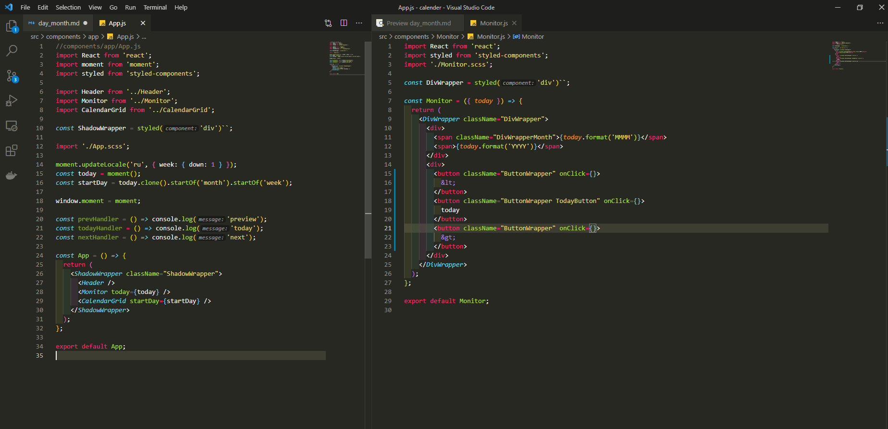
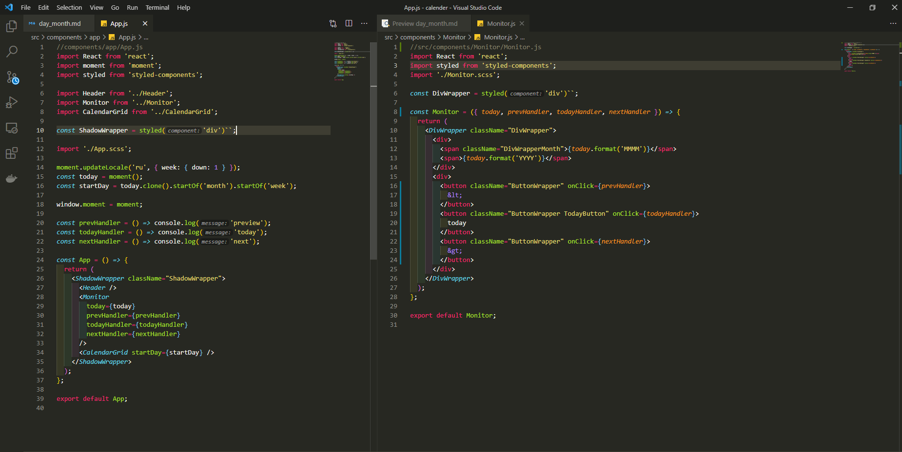
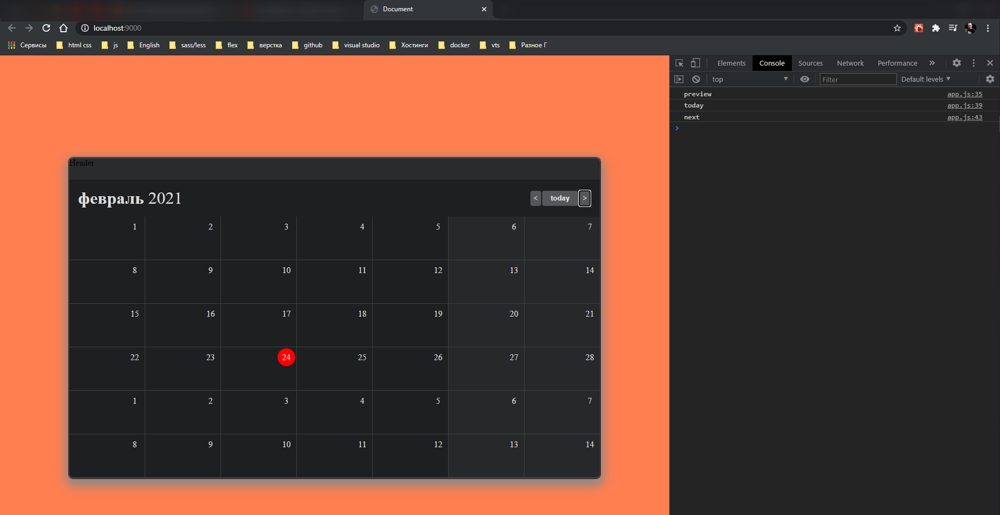
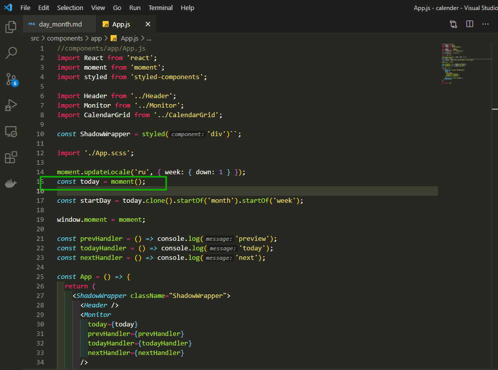
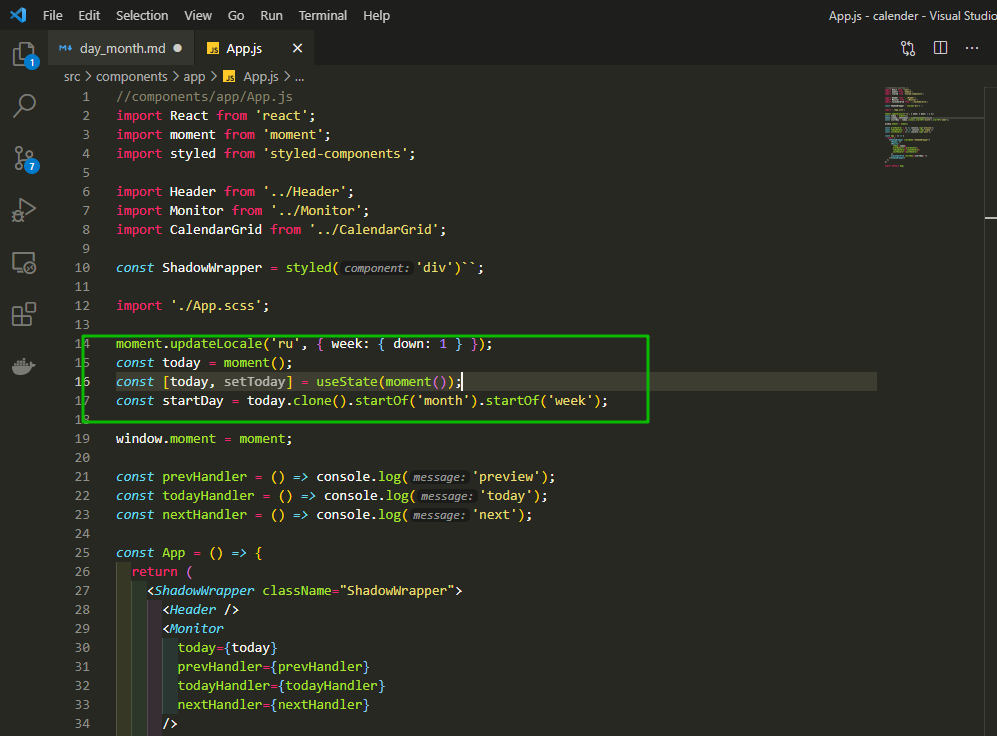
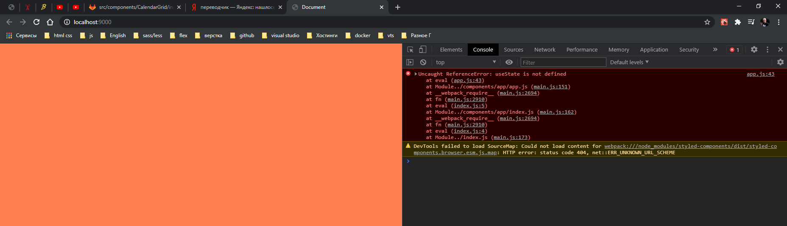
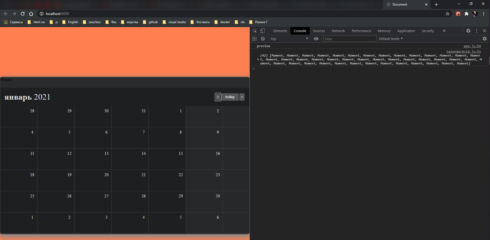
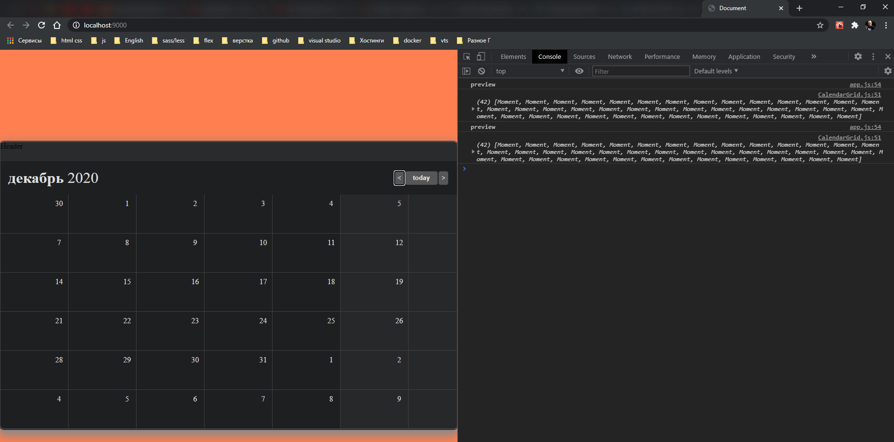
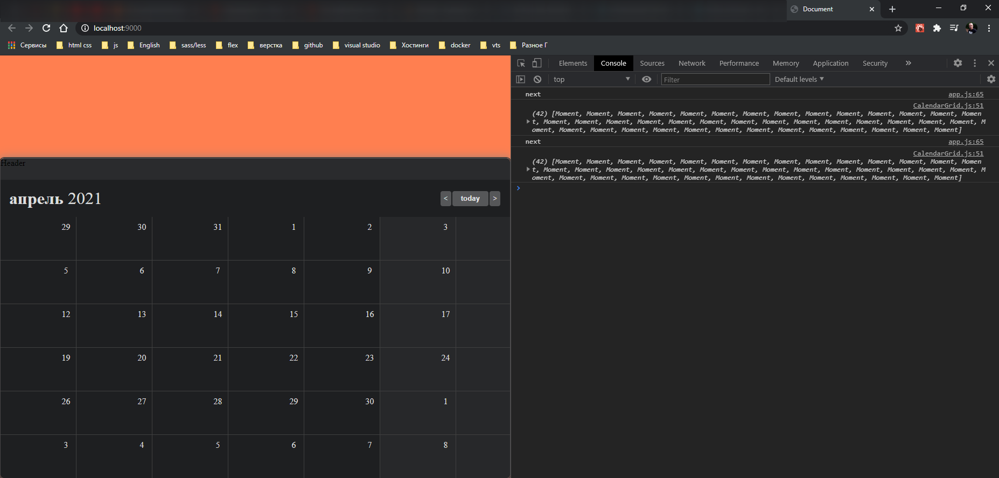
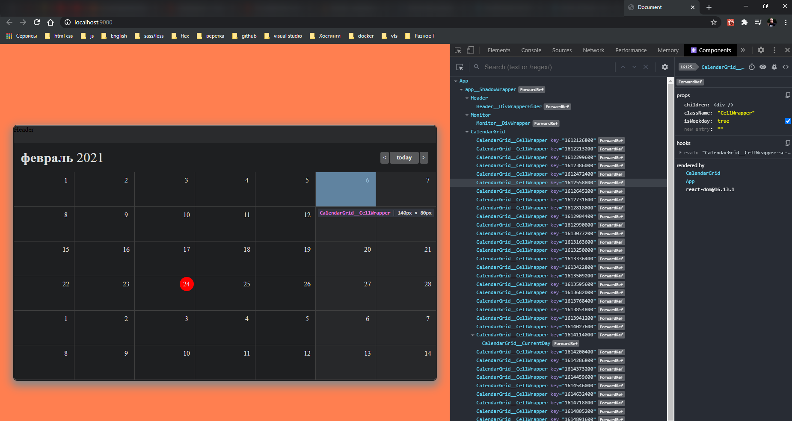

# Подсветка дня. Переключение месяца.

Сделаю переключение месяцев и подсветку **current** текущий день.

Начну с текущего дня. мне его нужно отобразить в сетке календаря. И так в разметку добавляю дополнительный **div**.


```jsx
//components/CalendarGrid/CalendarGrid.js
import React from 'react';
import styled from 'styled-components';
import './CalendarGrid.scss';

const CellWrapper = styled.div`
  background-color: ${(props) => (props.isWeekday ? '#27282A' : '#1E1F21')};
`;

const CalendarGrid = ({ startDay }) => {
  const day = startDay.clone().subtract(1, 'day');
  const daysArray = [...Array(42)].map(() => day.add(1, 'day').clone());
  // window.daysArray = daysArray;
  console.log(daysArray);

  return (
    <div className="GridWrapper">
      {daysArray.map((dayItem) => {
        return (
          <CellWrapper
            className="CellWrapper"
            key={dayItem.format('DDMMYY')}
            isWeekday={dayItem.day() === 6 || dayItem.day() === 0}
          >
            <div className="indexItem">
              <div className="RowInCell">
                <div className="DayWrapper">
                  <div>{dayItem.format('D')}</div>
                </div>
              </div>
            </div>
          </CellWrapper>
        );
      })}
    </div>
  );
};

export default CalendarGrid;
```


И вешаю стили на данный элемент.

```jsx
//components/CalendarGrid/CalendarGrid.js
import React from 'react';
import styled from 'styled-components';
import './CalendarGrid.scss';

const CellWrapper = styled.div`
  background-color: ${(props) => (props.isWeekday ? '#27282A' : '#1E1F21')};
`;

const CurrentDay = styled('div')``;

const CalendarGrid = ({ startDay }) => {
  const day = startDay.clone().subtract(1, 'day');
  const daysArray = [...Array(42)].map(() => day.add(1, 'day').clone());
  // window.daysArray = daysArray;
  console.log(daysArray);

  return (
    <div className="GridWrapper">
      {daysArray.map((dayItem) => {
        return (
          <CellWrapper
            className="CellWrapper"
            key={dayItem.format('DDMMYY')}
            isWeekday={dayItem.day() === 6 || dayItem.day() === 0}
          >
            <div className="indexItem">
              <div className="RowInCell">
                <div className="DayWrapper">
                  <CurrentDay className="CurrentDay">
                    {dayItem.format('D')}
                  </CurrentDay>
                </div>
              </div>
            </div>
          </CellWrapper>
        );
      })}
    </div>
  );
};

export default CalendarGrid;
```

```scss
//components/CalendarGrid/CalendarGrid.scss
.GridWrapper {
  display: grid;
  grid-template-columns: repeat(7, 1fr); // разбиваю на колонки
  grid-template-rows: repeat(6, 1fr);
  grid-gap: 1px; // зазор между ячейками
  background-color: #404040; // цвет подложки
}
.CellWrapper {
  min-width: 140px;
  min-height: 80px;
  background-color: #1e1f21;
  color: #dddcdd;
}

.RowInCell {
  display: flex;
  justify-content: flex-end;
}
.DayWrapper {
  height: 33px;
  width: 33px;
  display: flex;
  align-items: center;
  justify-content: center;
  margin: 2px;
  // outline: 1px solid green;
}

.CurrentDay {
  height: 100%;
  width: 100%;
  background-color: #f00;
  border-radius: 50%;
  display: flex;
  justify-content: center;
  align-items: center;
}
```


Теперь наша задача сделать так что бы текущий день был действительно текущим днем.

Создаю функцию **isCurrentDay = (day) =>{}**. В теле цикла должно быть возвращено булево значение.

В **DayWrapper** пишу условие в фигурных скобках **{!isCurrentDay(dayItem) && dayItem.format('D')}** Это если не является текущим днем.

А если является текущим днем, то **{isCurrentDay(dayItem) && \<CurrentDay className="CurrentDay">{dayItem.format('D')}</CurrentDay>}**.

```jsx
//components/CalendarGrid/CalendarGrid.js
import React from 'react';
import styled from 'styled-components';
import './CalendarGrid.scss';

const CellWrapper = styled.div`
  background-color: ${(props) => (props.isWeekday ? '#27282A' : '#1E1F21')};
`;

const CurrentDay = styled('div')``;

const CalendarGrid = ({ startDay }) => {
  const day = startDay.clone().subtract(1, 'day');
  const daysArray = [...Array(42)].map(() => day.add(1, 'day').clone());
  // window.daysArray = daysArray;
  console.log(daysArray);

  const isCurrentDay = (day) => true;

  return (
    <div className="GridWrapper">
      {daysArray.map((dayItem) => {
        return (
          <CellWrapper
            className="CellWrapper"
            key={dayItem.format('DDMMYY')}
            isWeekday={dayItem.day() === 6 || dayItem.day() === 0}
          >
            <div className="indexItem">
              <div className="RowInCell">
                <div className="DayWrapper">
                  {!isCurrentDay(dayItem) && dayItem.format('D')}
                  {isCurrentDay(dayItem) && (
                    <CurrentDay className="CurrentDay">
                      {dayItem.format('D')}
                    </CurrentDay>
                  )}
                </div>
              </div>
            </div>
          </CellWrapper>
        );
      })}
    </div>
  );
};

export default CalendarGrid;
```

Теперь пишу саму функцию **isCurrentDay**. Для этого нужно залезть в **moment**. В документации захожу в раздел **isSame** [https://momentjs.com/docs/#/query/is-same/](https://momentjs.com/docs/#/query/is-same/). И она будет проверять является ли одна часть выражения такой же как и другая.


И теперь мы можем передавать что конкретно мы сравниваем. **const isCurrentDay = (day) => moment().isSame()** и в **isSame** я передаю **day**, и вторым аргументом я передаю строковое значение то с чем буду сравнивать **'day'**.

```jsx
//components/CalendarGrid/CalendarGrid.js
import moment from 'moment';
import React from 'react';
import styled from 'styled-components';
import './CalendarGrid.scss';

const CellWrapper = styled.div`
  background-color: ${(props) => (props.isWeekday ? '#27282A' : '#1E1F21')};
`;

const CurrentDay = styled('div')``;

const CalendarGrid = ({ startDay }) => {
  const day = startDay.clone().subtract(1, 'day');
  const daysArray = [...Array(42)].map(() => day.add(1, 'day').clone());
  // window.daysArray = daysArray;
  console.log(daysArray);

  const isCurrentDay = (day) => moment().isSame(day, 'day');

  return (
    <div className="GridWrapper">
      {daysArray.map((dayItem) => {
        return (
          <CellWrapper
            className="CellWrapper"
            key={dayItem.format('DDMMYY')}
            isWeekday={dayItem.day() === 6 || dayItem.day() === 0}
          >
            <div className="indexItem">
              <div className="RowInCell">
                <div className="DayWrapper">
                  {!isCurrentDay(dayItem) && dayItem.format('D')}
                  {isCurrentDay(dayItem) && (
                    <CurrentDay className="CurrentDay">
                      {dayItem.format('D')}
                    </CurrentDay>
                  )}
                </div>
              </div>
            </div>
          </CellWrapper>
        );
      })}
    </div>
  );
};

export default CalendarGrid;
```


<br>
<br>
<hr>

2. Переключение месяца.

И так вешаю события клика на кнопки в компоненте **Monitor**.

```jsx
import React from 'react';
import styled from 'styled-components';
import './Monitor.scss';

const DivWrapper = styled('div')``;

const Monitor = ({ today }) => {
  return (
    <DivWrapper className="DivWrapper">
      <div>
        <span className="DivWrapperMonth">{today.format('MMMM')}</span>
        <span>{today.format('YYYY')}</span>
      </div>
      <div>
        <button
          className="ButtonWrapper"
          onClick={() => console.log('preview')}
        >
          &lt;
        </button>
        <button
          className="ButtonWrapper TodayButton"
          onClick={() => console.log('today')}
        >
          today
        </button>
        <button className="ButtonWrapper" onClick={() => console.log('next')}>
          &gt;
        </button>
      </div>
    </DivWrapper>
  );
};

export default Monitor;
```


Все четко отрабатывет. Единственно что? Эти функции должны отрабатывать в корне т.е. в **App.js**. Зачем это делается? А делается это для того что они должны изменять **startDay**

```js
//components/app/App.js
import React from 'react';
import moment from 'moment';
import styled from 'styled-components';

import Header from '../Header';
import Monitor from '../Monitor';
import CalendarGrid from '../CalendarGrid';

const ShadowWrapper = styled('div')``;

import './App.scss';

moment.updateLocale('ru', { week: { down: 1 } });
const today = moment();
const startDay = today.clone().startOf('month').startOf('week');

window.moment = moment;

const App = () => {
  return (
    <ShadowWrapper className="ShadowWrapper">
      <Header />
      <Monitor today={today} />
      <CalendarGrid startDay={startDay} />
    </ShadowWrapper>
  );
};

export default App;
```

Стартовые дни должны закидываться в сетку календаря. Для того что бы календарь отрисовался с другого стартового дня. Функции для мутации **startDay** должны находится в App.js.

В **App.js** создаю три функции.



```jsx
//components/app/App.js
import React from 'react';
import moment from 'moment';
import styled from 'styled-components';

import Header from '../Header';
import Monitor from '../Monitor';
import CalendarGrid from '../CalendarGrid';

const ShadowWrapper = styled('div')``;

import './App.scss';

moment.updateLocale('ru', { week: { down: 1 } });
const today = moment();
const startDay = today.clone().startOf('month').startOf('week');

window.moment = moment;

const prevHandler = () => console.log('preview');
const todayHandler = () => console.log('today');
const nextHandler = () => console.log('next');

const App = () => {
  return (
    <ShadowWrapper className="ShadowWrapper">
      <Header />
      <Monitor today={today} />
      <CalendarGrid startDay={startDay} />
    </ShadowWrapper>
  );
};

export default App;
```

```jsx
import React from 'react';
import styled from 'styled-components';
import './Monitor.scss';

const DivWrapper = styled('div')``;

const Monitor = ({ today }) => {
  return (
    <DivWrapper className="DivWrapper">
      <div>
        <span className="DivWrapperMonth">{today.format('MMMM')}</span>
        <span>{today.format('YYYY')}</span>
      </div>
      <div>
        <button className="ButtonWrapper" onClick={}>
          &lt;
        </button>
        <button className="ButtonWrapper TodayButton" onClick={}>
          today
        </button>
        <button className="ButtonWrapper" onClick={}>
          &gt;
        </button>
      </div>
    </DivWrapper>
  );
};

export default Monitor;
```

И теперь эти функции передаю в **Monitor.js** в виде **props**

```jsx
//components/app/App.js
import React from 'react';
import moment from 'moment';
import styled from 'styled-components';

import Header from '../Header';
import Monitor from '../Monitor';
import CalendarGrid from '../CalendarGrid';

const ShadowWrapper = styled('div')``;

import './App.scss';

moment.updateLocale('ru', { week: { down: 1 } });
const today = moment();
const startDay = today.clone().startOf('month').startOf('week');

window.moment = moment;

const prevHandler = () => console.log('preview');
const todayHandler = () => console.log('today');
const nextHandler = () => console.log('next');

const App = () => {
  return (
    <ShadowWrapper className="ShadowWrapper">
      <Header />
      <Monitor
        today={today}
        prevHandler={prevHandler}
        todayHandler={todayHandler}
        nextHandler={nextHandler}
      />
      <CalendarGrid startDay={startDay} />
    </ShadowWrapper>
  );
};

export default App;
```

И теперь отлавливаю данные функции в **Monitor.js**

```jsx
//src/components/Monitor/Monitor.js
import React from 'react';
import styled from 'styled-components';
import './Monitor.scss';

const DivWrapper = styled('div')``;

const Monitor = ({ today, prevHandler, todayHandler, nextHandler }) => {
  return (
    <DivWrapper className="DivWrapper">
      <div>
        <span className="DivWrapperMonth">{today.format('MMMM')}</span>
        <span>{today.format('YYYY')}</span>
      </div>
      <div>
        <button className="ButtonWrapper" onClick={prevHandler}>
          &lt;
        </button>
        <button className="ButtonWrapper TodayButton" onClick={todayHandler}>
          today
        </button>
        <button className="ButtonWrapper" onClick={nextHandler}>
          &gt;
        </button>
      </div>
    </DivWrapper>
  );
};

export default Monitor;
```





И теперь события с данных функций отлавливается и все прекрастно работает.

Теперь из библиотеки **moment** нужно два действия [add](https://momentjs.com/docs/#/manipulating/add/) и [subtract](https://momentjs.com/docs/#/manipulating/subtract/). Одна добавляет другая вычетает.

Пишу функцию **prevHandler**. Если я сейчас начну просто в тупую изменять, то будет проблема. Ничего не изменится по той простой банальной причине потому что для того что бы компонент перерисовался должно произойти одно из.

1. Либо долны изменится **Change Props**. Т.к. в этот компонент у нас ничего не попадает, то этот вариант отпадает.
2. у нас должно изменится состояние **Change State**. **State** у нас здесь нет по-этому тоже не вариант.
3. По-этому должно произойти **ForceUpdate()**.

Одна из функций жизненного цикла компонента [https://ru.reactjs.org/docs/react-component.html](https://ru.reactjs.org/docs/react-component.html) точнее [https://ru.reactjs.org/docs/react-component.html#forceupdate](https://ru.reactjs.org/docs/react-component.html#forceupdate).

Для того что бы перерендерить компонент он должен быть классовым.

Кароче. Нам нужно создать локальный **state** для компонента и соответственно мы будем изменять этот **state** и соответственно при изменении **state** у нас будет перерендериваться.

В **state** я предлагаю запихнуть **today**. Но здесь должно быть другое название. Это должна быть сущность которая отвечает за текущий лист календаря. Оставлю ее пока в виде **today**.

Инициализирую **const [today, setToday] = useState();** передаю туда вызов **moment()**. А вот что было до этого **const today = moment();** удаляю.

```jsx
//components/app/App.js
import React, { useState } from 'react';
import moment from 'moment';
import styled from 'styled-components';

import Header from '../Header';
import Monitor from '../Monitor';
import CalendarGrid from '../CalendarGrid';

const ShadowWrapper = styled('div')``;

import './App.scss';

moment.updateLocale('ru', { week: { down: 1 } });
const [today, setToday] = useState(moment());
const startDay = today.clone().startOf('month').startOf('week');

window.moment = moment;

const prevHandler = () => console.log('preview');
const todayHandler = () => console.log('today');
const nextHandler = () => console.log('next');

const App = () => {
  return (
    <ShadowWrapper className="ShadowWrapper">
      <Header />
      <Monitor
        today={today}
        prevHandler={prevHandler}
        todayHandler={todayHandler}
        nextHandler={nextHandler}
      />
      <CalendarGrid startDay={startDay} />
    </ShadowWrapper>
  );
};

export default App;
```

Я не знаю что за дич происходит с реактом. Оставляешь вот так все работает.



Начинаю инициализировать **state**




Но как только комментирую **const today = moment();** то все сыпется. хотя не должно.



**setToday** передаю в **prevHandler**

```jsx
//components/app/App.js
import React from 'react';
import moment from 'moment';
import styled from 'styled-components';

import Header from '../Header';
import Monitor from '../Monitor';
import CalendarGrid from '../CalendarGrid';

const ShadowWrapper = styled('div')``;

import './App.scss';

moment.updateLocale('ru', { week: { down: 1 } });
// const today = moment();
const [today, setToday] = useState(moment());
const startDay = today.clone().startOf('month').startOf('week');

window.moment = moment;

const prevHandler = () => {
  console.log('preview'), setToday();
};
const todayHandler = () => console.log('today');
const nextHandler = () => console.log('next');

const App = () => {
  return (
    <ShadowWrapper className="ShadowWrapper">
      <Header />
      <Monitor
        today={today}
        prevHandler={prevHandler}
        todayHandler={todayHandler}
        nextHandler={nextHandler}
      />
      <CalendarGrid startDay={startDay} />
    </ShadowWrapper>
  );
};

export default App;
```

И теперь есть два варианта я могу в **setToday()** переменную либо структуру данных. Либо же мы можем сюда передавать **callback** первым параметром которого будет предыдущее состояние **state**.

Оно нам как раз таки и нужно. т.е. мы берем предыдущее значение **state** и производим над ним манипуляции т.е. сдвигаем месяц либо в одну сторону, либо во вторую.

вычитаю один месяц

```js
const prevHandler = () => {
  console.log('preview'), setToday((prev) => prev.subtract(1, 'month'));
};
```

Вся ошибка заключалась в том что я банально писал весь код не внутри **function App**. И так рабочий код

```jsx
//components/app/App.js
import React from 'react';
import moment from 'moment';
import styled from 'styled-components';

import Header from '../Header';
import Monitor from '../Monitor';
import CalendarGrid from '../CalendarGrid';

import './App.scss';

const ShadowWrapper = styled('div')``;

function App() {
  moment.updateLocale('ru', { week: { down: 1 } });
  // const today = moment();
  const [today, setToday] = React.useState(moment());
  const startDay = today.clone().startOf('month').startOf('week');

  window.moment = moment;

  const prevHandler = () => {
    console.log('preview');
    setToday((prev) => prev.clone().subtract(1, 'month'));
  };
  const todayHandler = () => console.log('today');
  const nextHandler = () => console.log('next');

  return (
    <ShadowWrapper className="ShadowWrapper">
      <Header />
      <Monitor
        today={today}
        prevHandler={prevHandler}
        todayHandler={todayHandler}
        nextHandler={nextHandler}
      />
      <CalendarGrid startDay={startDay} />
    </ShadowWrapper>
  );
}

export default App;
```





И так назад переключается.

Теперь реализую **next**. Вместо **substract** использую **add**.

```js
//components/app/App.js
import React from 'react';
import moment from 'moment';
import styled from 'styled-components';

import Header from '../Header';
import Monitor from '../Monitor';
import CalendarGrid from '../CalendarGrid';

import './App.scss';

const ShadowWrapper = styled('div')``;

function App() {
  moment.updateLocale('ru', { week: { down: 1 } });
  // const today = moment();
  const [today, setToday] = React.useState(moment());
  const startDay = today.clone().startOf('month').startOf('week');

  window.moment = moment;

  const prevHandler = () => {
    console.log('preview');
    setToday((prev) => prev.clone().subtract(1, 'month'));
  };
  const todayHandler = () => console.log('today');
  const nextHandler = () => {
    console.log('next');
    setToday((prev) => prev.clone().add(1, 'month'));
  };

  return (
    <ShadowWrapper className="ShadowWrapper">
      <Header />
      <Monitor
        today={today}
        prevHandler={prevHandler}
        todayHandler={todayHandler}
        nextHandler={nextHandler}
      />
      <CalendarGrid startDay={startDay} />
    </ShadowWrapper>
  );
}

export default App;
```



И теперь осталось реализовать текущий месяц. И для этого просто прописываю **setToday(moment());** т.е. вызываю текущую дату. И все тип топ работает.

```jsx
//components/app/App.js
import React from 'react';
import moment from 'moment';
import styled from 'styled-components';

import Header from '../Header';
import Monitor from '../Monitor';
import CalendarGrid from '../CalendarGrid';

import './App.scss';

const ShadowWrapper = styled('div')``;

function App() {
  moment.updateLocale('ru', { week: { down: 1 } });
  // const today = moment();
  const [today, setToday] = React.useState(moment());
  const startDay = today.clone().startOf('month').startOf('week');

  window.moment = moment;

  const prevHandler = () => {
    setToday((prev) => prev.clone().subtract(1, 'month'));
  };
  const todayHandler = () => {
    setToday(moment());
  };
  const nextHandler = () => {
    setToday((prev) => prev.clone().add(1, 'month'));
  };

  return (
    <ShadowWrapper className="ShadowWrapper">
      <Header />
      <Monitor
        today={today}
        prevHandler={prevHandler}
        todayHandler={todayHandler}
        nextHandler={nextHandler}
      />
      <CalendarGrid startDay={startDay} />
    </ShadowWrapper>
  );
}

export default App;
```

<br>
<br>
<hr>

- **HotFix:** добавляю ключи к элементам списка.

Каждый день у нас уникальный. У него есть **Unix Time Stamp**. Т.е. количество секунд с **1970**. И мы можем легко его использовать ввиде ключа для нашего массива дней. Добавляю эти уникальные ключи к каждому дню в компоненте **CalendarGrid**. В **CellWrapper** добавляю атрибут ключа **key={dayItem.unix()}**.

```jsx
//components/CalendarGrid/CalendarGrid.js
import moment from 'moment';
import React from 'react';
import styled from 'styled-components';
import './CalendarGrid.scss';

const CellWrapper = styled.div`
  background-color: ${(props) => (props.isWeekday ? '#27282A' : '#1E1F21')};
`;

const CurrentDay = styled('div')``;

const CalendarGrid = ({ startDay }) => {
  const day = startDay.clone().subtract(1, 'day');
  const daysArray = [...Array(42)].map(() => day.add(1, 'day').clone());
  // window.daysArray = daysArray;
  console.log(daysArray);

  const isCurrentDay = (day) => moment().isSame(day, 'day');

  return (
    <div className="GridWrapper">
      {daysArray.map((dayItem) => {
        return (
          <CellWrapper
            className="CellWrapper"
            key={dayItem.unix()}
            isWeekday={dayItem.day() === 6 || dayItem.day() === 0}
          >
            <div className="indexItem">
              <div className="RowInCell">
                <div className="DayWrapper">
                  {!isCurrentDay(dayItem) && dayItem.format('D')}
                  {isCurrentDay(dayItem) && (
                    <CurrentDay className="CurrentDay">
                      {dayItem.format('D')}
                    </CurrentDay>
                  )}
                </div>
              </div>
            </div>
          </CellWrapper>
        );
      })}
    </div>
  );
};

export default CalendarGrid;
```



И вот каждый день уникален.
