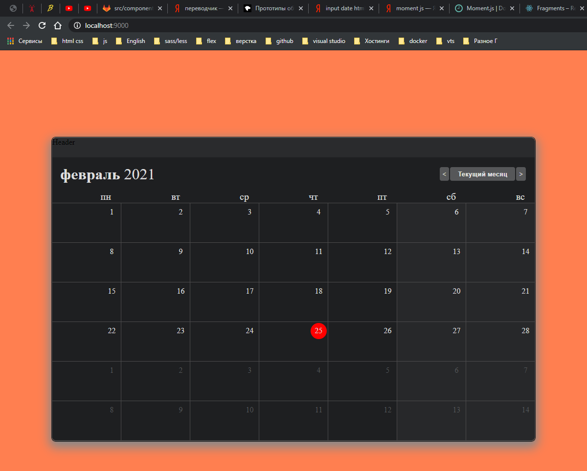

# Активный месяц.

И так сначало пишу условие **color: ${(props) => (props.isSelectedMonth ? '#DDDDDD' : '#555759')};**.

```jsx
const CellWrapper = styled.div`
  background-color: ${(props) => (props.isWeekday ? '#27282A' : '#1E1F21')};
  min-height: ${(props) => (props.isHeader ? 24 : 80)}px;
  color: ${(props) => (props.isSelectedMonth ? '#DDDDDD' : '#555759')};
`;
```

```jsx
//components/CalendarGrid/CalendarGrid.js
import moment from 'moment';
import React from 'react';
import styled from 'styled-components';
import './CalendarGrid.scss';

const GridWrapper = styled.div`
  background-color: ${(props) => (props.isHeader ? '#1e1f21' : '#4d4c4d')};
  ${(props) => props.isHeader && 'border-bottom: 1px solid #4d4c4d'}
`;

const CellWrapper = styled.div`
  background-color: ${(props) => (props.isWeekday ? '#27282A' : '#1E1F21')};
  min-height: ${(props) => (props.isHeader ? 24 : 80)}px;
  color: ${(props) => (props.isSelectedMonth ? '#DDDDDD' : '#555759')};
`;

const CurrentDay = styled('div')``;

const CalendarGrid = ({ startDay }) => {
  const day = startDay.clone().subtract(1, 'day');
  const daysArray = [...Array(42)].map(() => day.add(1, 'day').clone());
  // window.daysArray = daysArray;
  console.log(daysArray);

  const isCurrentDay = (day) => moment().isSame(day, 'day');

  return (
    <>
      <GridWrapper className="GridWrapper" isHeader>
        {[...Array(7)].map((_, i) => (
          <CellWrapper isHeader>
            <div className="RowInCell">
              <div className="DayColor">
                {moment()
                  .day(i + 1) // + 1 для понедельника
                  .format('dd')}
              </div>
            </div>
          </CellWrapper>
        ))}
      </GridWrapper>
      <GridWrapper className="GridWrapper">
        {daysArray.map((dayItem) => {
          return (
            <CellWrapper
              className="CellWrapper"
              key={dayItem.unix()}
              isWeekday={dayItem.day() === 6 || dayItem.day() === 0}
            >
              <div className="indexItem">
                <div className="RowInCell">
                  <div className="DayWrapper">
                    {!isCurrentDay(dayItem) && dayItem.format('D')}
                    {isCurrentDay(dayItem) && (
                      <CurrentDay className="CurrentDay">
                        {dayItem.format('D')}
                      </CurrentDay>
                    )}
                  </div>
                </div>
              </div>
            </CellWrapper>
          );
        })}
      </GridWrapper>
    </>
  );
};

export default CalendarGrid;
```

Передаю isSelectedMonth в CellWrapper и пишу функцию которая проверяет текущий месяц. const isSelectedMonth = (day) => moment().isSame(day, 'month'); и после передаю ее в

```jsx
<CellWrapper
className="CellWrapper"
key={dayItem.unix()}
isWeekday={dayItem.day() === 6 || dayItem.day() === 0}
isSelectedMonth={isSelectedMonth(dayItem)}
>
```

```jsx
//components/CalendarGrid/CalendarGrid.js
import moment from 'moment';
import React from 'react';
import styled from 'styled-components';
import './CalendarGrid.scss';

const GridWrapper = styled.div`
  background-color: ${(props) => (props.isHeader ? '#1e1f21' : '#4d4c4d')};
  ${(props) => props.isHeader && 'border-bottom: 1px solid #4d4c4d'}
`;

const CellWrapper = styled.div`
  background-color: ${(props) => (props.isWeekday ? '#27282A' : '#1E1F21')};
  min-height: ${(props) => (props.isHeader ? 24 : 80)}px;
  color: ${(props) => (props.isSelectedMonth ? '#DDDDDD' : '#555759')};
`;

const CurrentDay = styled('div')``;

const CalendarGrid = ({ startDay }) => {
  const day = startDay.clone().subtract(1, 'day');
  const daysArray = [...Array(42)].map(() => day.add(1, 'day').clone());
  // window.daysArray = daysArray;
  console.log(daysArray);

  const isCurrentDay = (day) => moment().isSame(day, 'day');
  const isSelectedMonth = (day) => moment().isSame(day, 'month');

  return (
    <>
      <GridWrapper className="GridWrapper" isHeader>
        {[...Array(7)].map((_, i) => (
          <CellWrapper isHeader>
            <div className="RowInCell">
              <div className="DayColor">
                {moment()
                  .day(i + 1) // + 1 для понедельника
                  .format('dd')}
              </div>
            </div>
          </CellWrapper>
        ))}
      </GridWrapper>
      <GridWrapper className="GridWrapper">
        {daysArray.map((dayItem) => {
          return (
            <CellWrapper
              className="CellWrapper"
              key={dayItem.unix()}
              isWeekday={dayItem.day() === 6 || dayItem.day() === 0}
              isSelectedMonth={isSelectedMonth(dayItem)}
            >
              <div className="indexItem">
                <div className="RowInCell">
                  <div className="DayWrapper">
                    {!isCurrentDay(dayItem) && dayItem.format('D')}
                    {isCurrentDay(dayItem) && (
                      <CurrentDay className="CurrentDay">
                        {dayItem.format('D')}
                      </CurrentDay>
                    )}
                  </div>
                </div>
              </div>
            </CellWrapper>
          );
        })}
      </GridWrapper>
    </>
  );
};

export default CalendarGrid;
```



И вот оно заработало но не совсем. Оно заработало для текущего месяца который сейчас. Другие мясяца не активны. Но при переключении я хочу что бы выделялся активный месяц.

В App.js в CalendarGrid передаю еще один props today={today}

```jsx
//components/app/App.js
import React from 'react';
import moment from 'moment';
import styled from 'styled-components';

import Header from '../Header';
import Monitor from '../Monitor';
import CalendarGrid from '../CalendarGrid';

import './App.scss';

const ShadowWrapper = styled('div')``;

function App() {
  moment.updateLocale('ru', { week: { down: 1 } });
  // const today = moment();
  const [today, setToday] = React.useState(moment());
  const startDay = today.clone().startOf('month').startOf('week');

  window.moment = moment;

  const prevHandler = () => {
    setToday((prev) => prev.clone().subtract(1, 'month'));
  };
  const todayHandler = () => {
    setToday(moment());
  };
  const nextHandler = () => {
    setToday((prev) => prev.clone().add(1, 'month'));
  };

  return (
    <ShadowWrapper className="ShadowWrapper">
      <Header />
      <Monitor
        today={today}
        prevHandler={prevHandler}
        todayHandler={todayHandler}
        nextHandler={nextHandler}
      />
      <CalendarGrid startDay={startDay} today={today} />
    </ShadowWrapper>
  );
}

export default App;
```

Далее в CalendarGrid отлавливаю его занося в параметры т.е. вторым параметром в CalendarGrid. В isSelectedMonth обращаюсь не к moment а к day

```jsx
//components/CalendarGrid/CalendarGrid.js
import moment from 'moment';
import React from 'react';
import styled from 'styled-components';
import './CalendarGrid.scss';

const GridWrapper = styled.div`
  background-color: ${(props) => (props.isHeader ? '#1e1f21' : '#4d4c4d')};
  ${(props) => props.isHeader && 'border-bottom: 1px solid #4d4c4d'}
`;

const CellWrapper = styled.div`
  background-color: ${(props) => (props.isWeekday ? '#27282A' : '#1E1F21')};
  min-height: ${(props) => (props.isHeader ? 24 : 80)}px;
  color: ${(props) => (props.isSelectedMonth ? '#DDDDDD' : '#555759')};
`;

const CurrentDay = styled('div')``;

const CalendarGrid = ({ startDay, today }) => {
  const day = startDay.clone().subtract(1, 'day');
  const daysArray = [...Array(42)].map(() => day.add(1, 'day').clone());
  // window.daysArray = daysArray;
  console.log(daysArray);

  const isCurrentDay = (day) => moment().isSame(day, 'day');
  const isSelectedMonth = (day) => today.isSame(day, 'month');

  return (
    <>
      <GridWrapper className="GridWrapper" isHeader>
        {[...Array(7)].map((_, i) => (
          <CellWrapper isHeader>
            <div className="RowInCell">
              <div className="DayColor">
                {moment()
                  .day(i + 1) // + 1 для понедельника
                  .format('dd')}
              </div>
            </div>
          </CellWrapper>
        ))}
      </GridWrapper>
      <GridWrapper className="GridWrapper">
        {daysArray.map((dayItem) => {
          return (
            <CellWrapper
              className="CellWrapper"
              key={dayItem.unix()}
              isWeekday={dayItem.day() === 6 || dayItem.day() === 0}
              isSelectedMonth={isSelectedMonth(dayItem)}
            >
              <div className="indexItem">
                <div className="RowInCell">
                  <div className="DayWrapper">
                    {!isCurrentDay(dayItem) && dayItem.format('D')}
                    {isCurrentDay(dayItem) && (
                      <CurrentDay className="CurrentDay">
                        {dayItem.format('D')}
                      </CurrentDay>
                    )}
                  </div>
                </div>
              </div>
            </CellWrapper>
          );
        })}
      </GridWrapper>
    </>
  );
};

export default CalendarGrid;
```

Сложно для понимания однако. Пробуй несколько раз запилить его.
